# Design Patterns in Software Development

- [Design Patterns in Software Development](#design-patterns-in-software-development)
  - [1. Introduction](#1-introduction)
    - [1.1 What are Design Patterns?](#11-what-are-design-patterns)
    - [1.2 Why Use Design Patterns?](#12-why-use-design-patterns)
    - [1.3 Design Patterns in E-commerce](#13-design-patterns-in-e-commerce)
  - [2. Types of Design Patterns](#2-types-of-design-patterns)
    - [2.1 Creational Patterns](#21-creational-patterns)
      - [2.1.1 Singleton](#211-singleton)
      - [2.1.2 Factory Method](#212-factory-method)
      - [2.1.3 Abstract Factory](#213-abstract-factory)
      - [2.1.4 Builder](#214-builder)
      - [2.1.5 Prototype](#215-prototype)
    - [2.2 Structural Patterns](#22-structural-patterns)
      - [2.2.1 Adapter](#221-adapter)
      - [2.2.2 Bridge](#222-bridge)
      - [2.2.3 Composite](#223-composite)
      - [2.2.4 Decorator](#224-decorator)
      - [2.2.5 Facade](#225-facade)
      - [2.2.6 Flyweight](#226-flyweight)
      - [2.2.7 Proxy](#227-proxy)
    - [2.3 Behavioral Patterns](#23-behavioral-patterns)
      - [2.3.1 Chain of Responsibility](#231-chain-of-responsibility)
      - [2.3.2 Command](#232-command)
      - [2.3.3 Iterator](#233-iterator)
      - [2.3.4 Mediator](#234-mediator)
      - [2.3.5 Memento](#235-memento)
      - [2.3.6 Observer](#236-observer)
      - [2.3.7 State](#237-state)
      - [2.3.8 Strategy](#238-strategy)
      - [2.3.9 Template Method](#239-template-method)
      - [2.3.10 Visitor](#2310-visitor)
  - [3. Design Patterns in the Software Development Lifecycle](#3-design-patterns-in-the-software-development-lifecycle)
    - [3.1 Analysis and Planning Phase](#31-analysis-and-planning-phase)
    - [3.2 Design Phase](#32-design-phase)
    - [3.3 Implementation Phase](#33-implementation-phase)
    - [3.4 Maintenance and Extension Phase](#34-maintenance-and-extension-phase)
  - [4. Implementing Design Patterns](#4-implementing-design-patterns)
  - [5. Anti-Patterns](#5-anti-patterns)
  - [6. Best Practices](#6-best-practices)
  - [7. Glossary](#7-glossary)


## 1. Introduction

### 1.1 What are Design Patterns?

Design Patterns are reusable solutions to common problems in software design. They represent best practices evolved over time by experienced software developers. These patterns are not finished designs that can be transformed directly into code, but rather templates for how to solve a problem in many different situations.

Design patterns provide a shared vocabulary for developers, making it easier to communicate ideas and discuss software architecture. They encapsulate the essence of design problems and their solutions, allowing developers to apply proven techniques to new situations.

### 1.2 Why Use Design Patterns?

Using design patterns offers several benefits:

1. **Proven Solutions**: Design patterns provide tried and tested solutions to common design problems, reducing the risk of introducing bugs or architectural flaws.

2. **Reusability**: They promote reusable designs, which leads to more robust and maintainable code. Once a developer is familiar with a pattern, they can recognize and apply it in various contexts.

3. **Scalability**: Design patterns often contribute to creating scalable applications by providing flexible structures that can accommodate growth and change.

4. **Communication**: They establish a common vocabulary for developers, making it easier to discuss and document software designs. When a team member says "we should use the Observer pattern here," others immediately understand the proposed solution.

5. **Best Practices**: Design patterns encapsulate best practices developed over time by experienced programmers. By using them, developers can leverage this collective wisdom.

6. **Faster Development**: Once familiar with design patterns, developers can design and implement solutions more quickly, as they're working with proven blueprints rather than starting from scratch.

7. **Code Organization**: Many design patterns help in organizing code in a more logical and manageable way, improving the overall structure of the application.

### 1.3 Design Patterns in E-commerce

E-commerce systems are complex and require robust, scalable, and maintainable software architecture. Design patterns are particularly valuable in this context. Let's consider some examples:

1. **Catalog Management**: The Composite pattern can be used to represent product categories and individual products in a unified way.

2. **Shopping Cart**: The Memento pattern can be employed to save and restore the state of a shopping cart, enabling features like "save for later."

3. **Payment Processing**: The Strategy pattern allows for easy switching between different payment methods.

4. **Order Fulfillment**: The State pattern can model the various stages of order processing.

5. **Product Recommendations**: The Observer pattern can be used to update product recommendations based on user behavior.

Throughout this guide, we'll explore these and many other applications of design patterns in e-commerce systems, providing concrete examples and implementations.

## 2. Types of Design Patterns

Design patterns are typically categorized into three main types: Creational, Structural, and Behavioral. Let's explore each category and the patterns within them.

### 2.1 Creational Patterns

Creational patterns deal with object creation mechanisms, trying to create objects in a manner suitable to the situation. They help make a system independent of how its objects are created, composed, and represented.

#### 2.1.1 Singleton

The Singleton pattern ensures a class has only one instance and provides a global point of access to it.

**When to use**: Use the Singleton pattern when you want to ensure that only one instance of a class is created and when you need a global point of access to this instance. In e-commerce, this could be used for managing a shopping cart or a database connection pool.

**Example**: Let's implement a DatabaseConnection class as a Singleton in our e-commerce system.

```python
class DatabaseConnection:
    _instance = None

    def __new__(cls):
        if cls._instance is None:
            cls._instance = super().__new__(cls)
            cls._instance.connect()
        return cls._instance

    def connect(self):
        # Simulating database connection
        print("Connecting to the database...")

    def query(self, sql):
        # Simulating database query
        print(f"Executing query: {sql}")

# Usage
connection1 = DatabaseConnection()
connection2 = DatabaseConnection()

print(connection1 is connection2)  # True

connection1.query("SELECT * FROM products")
connection2.query("SELECT * FROM orders")
```

In this example, no matter how many times we instantiate `DatabaseConnection`, we always get the same instance. This ensures that we're not creating multiple database connections unnecessarily.

#### 2.1.2 Factory Method

The Factory Method pattern defines an interface for creating an object, but lets subclasses decide which class to instantiate.

**When to use**: Use the Factory Method when you want to provide a way to create objects without specifying their exact class. In e-commerce, this could be used for creating different types of products or payment methods.

**Example**: Let's implement a payment method factory for our e-commerce system.

```python
from abc import ABC, abstractmethod

class PaymentMethod(ABC):
    @abstractmethod
    def process_payment(self, amount):
        pass

class CreditCardPayment(PaymentMethod):
    def process_payment(self, amount):
        print(f"Processing credit card payment of ${amount}")

class PayPalPayment(PaymentMethod):
    def process_payment(self, amount):
        print(f"Processing PayPal payment of ${amount}")

class PaymentMethodFactory:
    @staticmethod
    def create_payment_method(method_type):
        if method_type == "credit_card":
            return CreditCardPayment()
        elif method_type == "paypal":
            return PayPalPayment()
        else:
            raise ValueError("Invalid payment method")

# Usage
factory = PaymentMethodFactory()

credit_card = factory.create_payment_method("credit_card")
credit_card.process_payment(100)

paypal = factory.create_payment_method("paypal")
paypal.process_payment(50)
```

This Factory Method allows us to create different payment method objects without specifying their exact classes. We can easily add new payment methods by creating new classes and updating the factory.

#### 2.1.3 Abstract Factory

The Abstract Factory pattern provides an interface for creating families of related or dependent objects without specifying their concrete classes.

**When to use**: Use the Abstract Factory when your system needs to be independent of how its products are created, composed, and represented. In e-commerce, this could be used for creating different types of products with their variations.

**Example**: Let's implement an abstract factory for creating furniture products in our e-commerce system.

```python
from abc import ABC, abstractmethod

# Abstract Product Classes
class Chair(ABC):
    @abstractmethod
    def sit_on(self):
        pass

class Table(ABC):
    @abstractmethod
    def put_on(self):
        pass

# Concrete Product Classes
class ModernChair(Chair):
    def sit_on(self):
        return "Sitting on a modern chair"

class ModernTable(Table):
    def put_on(self):
        return "Putting item on a modern table"

class VictorianChair(Chair):
    def sit_on(self):
        return "Sitting on a Victorian chair"

class VictorianTable(Table):
    def put_on(self):
        return "Putting item on a Victorian table"

# Abstract Factory
class FurnitureFactory(ABC):
    @abstractmethod
    def create_chair(self):
        pass

    @abstractmethod
    def create_table(self):
        pass

# Concrete Factories
class ModernFurnitureFactory(FurnitureFactory):
    def create_chair(self):
        return ModernChair()

    def create_table(self):
        return ModernTable()

class VictorianFurnitureFactory(FurnitureFactory):
    def create_chair(self):
        return VictorianChair()

    def create_table(self):
        return VictorianTable()

# Client Code
def client_code(factory: FurnitureFactory):
    chair = factory.create_chair()
    table = factory.create_table()

    print(chair.sit_on())
    print(table.put_on())

# Usage
print("Client: Testing client code with Modern Furniture Factory:")
client_code(ModernFurnitureFactory())

print("\nClient: Testing client code with Victorian Furniture Factory:")
client_code(VictorianFurnitureFactory())
```

This Abstract Factory allows us to create families of related products (chairs and tables) without specifying their concrete classes. We can easily add new furniture styles by creating new concrete factories and product classes.

#### 2.1.4 Builder

The Builder pattern separates the construction of a complex object from its representation, allowing the same construction process to create various representations.

**When to use**: Use the Builder pattern when you need to create complex objects with many optional components or configurations. In e-commerce, this could be used for creating customized products or complex order objects.

**Example**: Let's implement a builder for creating customized computer products in our e-commerce system.

```python
class Computer:
    def __init__(self):
        self.cpu = None
        self.memory = None
        self.storage = None
        self.gpu = None

    def __str__(self):
        return f"Computer: CPU={self.cpu}, Memory={self.memory}GB, Storage={self.storage}GB, GPU={self.gpu}"

class ComputerBuilder:
    def __init__(self):
        self.computer = Computer()

    def add_cpu(self, cpu):
        self.computer.cpu = cpu
        return self

    def add_memory(self, memory):
        self.computer.memory = memory
        return self

    def add_storage(self, storage):
        self.computer.storage = storage
        return self

    def add_gpu(self, gpu):
        self.computer.gpu = gpu
        return self

    def build(self):
        return self.computer

class ComputerDirector:
    def __init__(self, builder):
        self.builder = builder

    def build_gaming_computer(self):
        return self.builder.add_cpu("Intel i9").add_memory(32).add_storage(1000).add_gpu("NVIDIA RTX 3080").build()

    def build_office_computer(self):
        return self.builder.add_cpu("Intel i5").add_memory(16).add_storage(512).build()

# Usage
builder = ComputerBuilder()
director = ComputerDirector(builder)

gaming_computer = director.build_gaming_computer()
print(gaming_computer)

office_computer = director.build_office_computer()
print(office_computer)

custom_computer = builder.add_cpu("AMD Ryzen 7").add_memory(64).add_storage(2000).add_gpu("AMD Radeon RX 6800").build()
print(custom_computer)
```

This Builder pattern allows us to construct complex Computer objects step by step. The ComputerDirector class demonstrates how we can use the builder to create predefined configurations, while we can also use the builder directly for custom configurations.

#### 2.1.5 Prototype

The Prototype pattern specifies the kinds of objects to create using a prototypical instance, and create new objects by copying this prototype.

**When to use**: Use the Prototype pattern when you need to create new objects by copying existing ones, especially when the creation process is more expensive than copying. In e-commerce, this could be used for creating variations of products or for duplicating complex objects like shopping carts.

**Example**: Let's implement a prototype for creating variations of product objects in our e-commerce system.

```python
import copy

class ProductPrototype:
    def __init__(self, name, category, price):
        self.name = name
        self.category = category
        self.price = price

    def clone(self):
        return copy.deepcopy(self)

    def __str__(self):
        return f"Product: {self.name}, Category: {self.category}, Price: ${self.price}"

class ProductCatalog:
    def __init__(self):
        self.products = {}

    def add_product(self, key, product):
        self.products[key] = product

    def get_product(self, key):
        return self.products[key].clone()

# Usage
catalog = ProductCatalog()

# Add base products
base_laptop = ProductPrototype("Laptop", "Electronics", 1000)
base_smartphone = ProductPrototype("Smartphone", "Electronics", 500)

catalog.add_product("base_laptop", base_laptop)
catalog.add_product("base_smartphone", base_smartphone)

# Create variations
laptop_variant = catalog.get_product("base_laptop")
laptop_variant.name = "Gaming Laptop"
laptop_variant.price = 1500

smartphone_variant = catalog.get_product("base_smartphone")
smartphone_variant.name = "5G Smartphone"
smartphone_variant.price = 700

print(base_laptop)
print(laptop_variant)
print(base_smartphone)
print(smartphone_variant)
```

In this example, we use the Prototype pattern to create base product objects and then clone them to create variations. This is particularly useful when we have complex product objects with many attributes, and we want to create slight variations without going through the entire initialization process again.

### 2.2 Structural Patterns

Structural patterns are concerned with how classes and objects are composed to form larger structures. They help ensure that if one part of a system changes, the entire structure doesn't need to change.

#### 2.2.1 Adapter

The Adapter pattern allows incompatible interfaces to work together. It acts as a bridge between two incompatible interfaces by wrapping the interface of a class into an interface a client expects.

**When to use**: Use the Adapter pattern when you want to use an existing class, but its interface isn't compatible with the rest of your code. It's particularly useful in systems that have to work with legacy code or third-party libraries.

**Example**: Let's implement an adapter for integrating a third-party payment gateway into our e-commerce system.

```python
class OldPaymentGateway:
    def __init__(self):
        self.name = "OldPaymentGateway"

    def make_payment(self, amount):
        return f"Payment of ${amount} processed through {self.name}"

class NewPaymentInterface:
    def process_payment(self, amount):
        pass

class PaymentGatewayAdapter(NewPaymentInterface):
    def __init__(self, old_gateway):
        self.old_gateway = old_gateway

    def process_payment(self, amount):
        return self.old_gateway.make_payment(amount)

# Usage
old_gateway = OldPaymentGateway()
adapter = PaymentGatewayAdapter(old_gateway)

# Client code
def client_code(payment_processor):
    return payment_processor.process_payment(100)

print(client_code(adapter))
```

In this example, we have an `OldPaymentGateway` with a `make_payment` method, but our new system expects a `process_payment` method. The `PaymentGatewayAdapter` wraps the old gateway and provides the expected interface, allowing us to use the old gateway in our new system without changing its code.

Here's a Mermaid diagram illustrating the Adapter pattern:

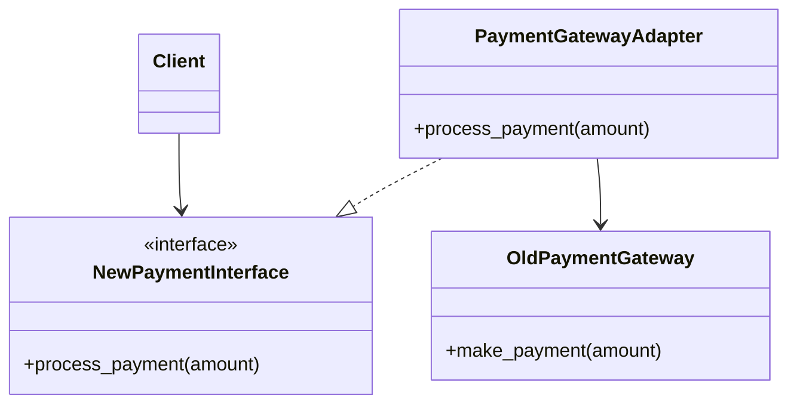
```mermaid
classDiagram
    class Client
    class NewPaymentInterface {
        <<interface>>
        +process_payment(amount)
    }
    class PaymentGatewayAdapter {
        +process_payment(amount)
    }
    class OldPaymentGateway {
        +make_payment(amount)
    }
    Client --> NewPaymentInterface
    PaymentGatewayAdapter ..|> NewPaymentInterface
    PaymentGatewayAdapter --> OldPaymentGateway
```

#### 2.2.2 Bridge

The Bridge pattern decouples an abstraction from its implementation so that the two can vary independently. It's especially useful when both the abstraction and its implementation need to be extended independently.

**When to use**: Use the Bridge pattern when you want to divide and organize a monolithic class that has several variants of some functionality, or when you need to extend a class in several orthogonal (independent) dimensions.

**Example**: Let's implement a bridge pattern for different types of discounts applied to different types of products in our e-commerce system.

```python
from abc import ABC, abstractmethod

# Implementor
class Discount(ABC):
    @abstractmethod
    def apply(self, price):
        pass

# Concrete Implementors
class PercentageDiscount(Discount):
    def __init__(self, percentage):
        self.percentage = percentage

    def apply(self, price):
        return price * (1 - self.percentage / 100)

class FixedDiscount(Discount):
    def __init__(self, amount):
        self.amount = amount

    def apply(self, price):
        return max(0, price - self.amount)

# Abstraction
class Product(ABC):
    def __init__(self, name, price, discount):
        self.name = name
        self.price = price
        self.discount = discount

    @abstractmethod
    def get_discounted_price(self):
        pass

# Refined Abstractions
class Electronics(Product):
    def get_discounted_price(self):
        return self.discount.apply(self.price)

class Clothing(Product):
    def get_discounted_price(self):
        return self.discount.apply(self.price) - 5  # Additional $5 off for clothing

# Usage
percentage_discount = PercentageDiscount(20)  # 20% off
fixed_discount = FixedDiscount(50)  # $50 off

laptop = Electronics("Laptop", 1000, percentage_discount)
print(f"{laptop.name} discounted price: ${laptop.get_discounted_price()}")

shirt = Clothing("T-Shirt", 30, fixed_discount)
print(f"{shirt.name} discounted price: ${shirt.get_discounted_price()}")
```

In this example, we have separated the discount calculation (implementation) from the product types (abstraction). This allows us to combine any type of product with any type of discount, and to add new types of either without affecting the other.

Here's a Mermaid diagram illustrating the Bridge pattern:

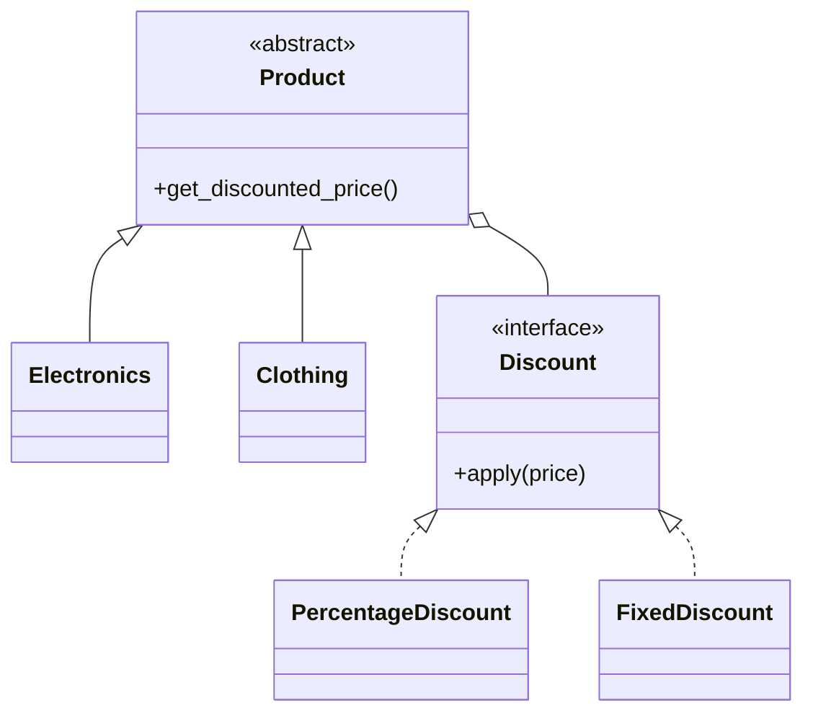
```mermaid
classDiagram
    class Product {
        <<abstract>>
        +get_discounted_price()
    }
    class Electronics
    class Clothing
    class Discount {
        <<interface>>
        +apply(price)
    }
    class PercentageDiscount
    class FixedDiscount
    Product <|-- Electronics
    Product <|-- Clothing
    Product o-- Discount
    Discount <|.. PercentageDiscount
    Discount <|.. FixedDiscount

```

#### 2.2.3 Composite

The Composite pattern composes objects into tree structures to represent part-whole hierarchies. It lets clients treat individual objects and compositions of objects uniformly.

**When to use**: Use the Composite pattern when you want clients to be able to ignore the difference between compositions of objects and individual objects. If you have a tree-like object structure and want to treat all objects in the structure uniformly, this pattern is ideal.

**Example**: Let's implement a composite pattern for representing a product catalog in our e-commerce system, where both individual products and categories (which can contain products or other categories) are treated uniformly.

```python
from abc import ABC, abstractmethod

class CatalogComponent(ABC):
    @abstractmethod
    def display(self):
        pass

    @abstractmethod
    def get_price(self):
        pass

class Product(CatalogComponent):
    def __init__(self, name, price):
        self.name = name
        self.price = price

    def display(self):
        print(f"Product: {self.name}, Price: ${self.price}")

    def get_price(self):
        return self.price

class Category(CatalogComponent):
    def __init__(self, name):
        self.name = name
        self.children = []

    def add(self, component):
        self.children.append(component)

    def remove(self, component):
        self.children.remove(component)

    def display(self):
        print(f"Category: {self.name}")
        for child in self.children:
            child.display()

    def get_price(self):
        return sum(child.get_price() for child in self.children)

# Usage
# Creating products
laptop = Product("Laptop", 1000)
smartphone = Product("Smartphone", 500)
headphones = Product("Headphones", 100)

# Creating categories
electronics = Category("Electronics")
electronics.add(laptop)
electronics.add(smartphone)

accessories = Category("Accessories")
accessories.add(headphones)

# Creating main catalog
main_catalog = Category("Main Catalog")
main_catalog.add(electronics)
main_catalog.add(accessories)

# Display entire catalog
main_catalog.display()

# Get total price of catalog
print(f"Total catalog value: ${main_catalog.get_price()}")
```

In this example, both `Product` and `Category` implement the `CatalogComponent` interface, allowing us to treat individual products and categories (which may contain other categories or products) uniformly. This creates a tree-like structure that's easy to traverse and manipulate.

Here's a Mermaid diagram illustrating the Composite pattern:

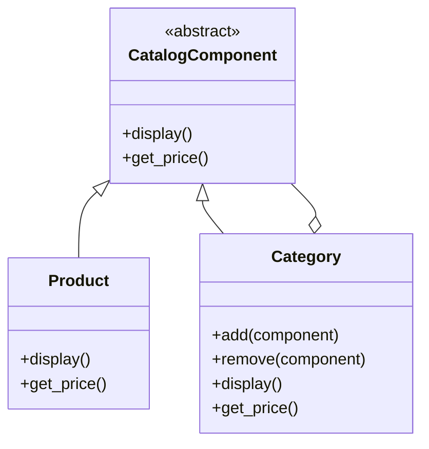
```mermaid
classDiagram
    class CatalogComponent {
        <<abstract>>
        +display()
        +get_price()
    }
    class Product {
        +display()
        +get_price()
    }
    class Category {
        +add(component)
        +remove(component)
        +display()
        +get_price()
    }
    CatalogComponent <|-- Product
    CatalogComponent <|-- Category
    Category o-- CatalogComponent

```

#### 2.2.4 Decorator

The Decorator pattern attaches additional responsibilities to an object dynamically. It provides a flexible alternative to subclassing for extending functionality.

**When to use**: Use the Decorator pattern when you need to be able to assign extra behaviors to objects at runtime without breaking the code that uses these objects. It's also useful when you want to add responsibilities to objects without modifying their code.

**Example**: Let's implement a decorator pattern for adding various features to a basic e-commerce order in our system.

```python
from abc import ABC, abstractmethod

class Order(ABC):
    @abstractmethod
    def get_description(self):
        pass

    @abstractmethod
    def get_cost(self):
        pass

class BasicOrder(Order):
    def get_description(self):
        return "Basic Order"

    def get_cost(self):
        return 10.0

class OrderDecorator(Order):
    def __init__(self, order):
        self.order = order

    def get_description(self):
        return self.order.get_description()

    def get_cost(self):
        return self.order.get_cost()

class ExpressShipping(OrderDecorator):
    def get_description(self):
        return f"{self.order.get_description()}, Express Shipping"

    def get_cost(self):
        return self.order.get_cost() + 5.0

class GiftWrap(OrderDecorator):
    def get_description(self):
        return f"{self.order.get_description()}, Gift Wrapped"

    def get_cost(self):
        return self.order.get_cost() + 3.0

class Insurance(OrderDecorator):
    def get_description(self):
        return f"{self.order.get_description()}, Insured"

    def get_cost(self):
        return self.order.get_cost() + 7.0

# Usage
order = BasicOrder()
print(f"{order.get_description()} costs ${order.get_cost()}")

express_order = ExpressShipping(order)
print(f"{express_order.get_description()} costs ${express_order.get_cost()}")

gift_order = GiftWrap(express_order)
print(f"{gift_order.get_description()} costs ${gift_order.get_cost()}")

insured_gift_order = Insurance(gift_order)
print(f"{insured_gift_order.get_description()} costs ${insured_gift_order.get_cost()}")
```

In this example, we start with a `BasicOrder` and can dynamically add features like express shipping, gift wrapping, and insurance. Each decorator adds its own cost and description to the order, allowing for flexible combinations of features.

Here's a Mermaid diagram illustrating the Decorator pattern:

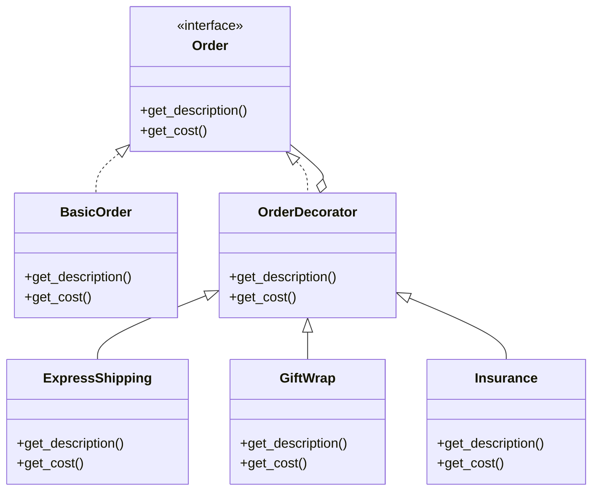
```mermaid
classDiagram
    class Order {
        <<interface>>
        +get_description()
        +get_cost()
    }
    class BasicOrder {
        +get_description()
        +get_cost()
    }
    class OrderDecorator {
        +get_description()
        +get_cost()
    }
    class ExpressShipping {
        +get_description()
        +get_cost()
    }
    class GiftWrap {
        +get_description()
        +get_cost()
    }
    class Insurance {
        +get_description()
        +get_cost()
    }
    Order <|.. BasicOrder
    Order <|.. OrderDecorator
    OrderDecorator <|-- ExpressShipping
    OrderDecorator <|-- GiftWrap
    OrderDecorator <|-- Insurance
    OrderDecorator o-- Order

```

This concludes our discussion of the first four Structural Patterns. In the next part, we'll cover the remaining Structural Patterns (Facade, Flyweight, and Proxy) and then move on to Behavioral Patterns.

#### 2.2.5 Facade

The Facade pattern provides a unified interface to a set of interfaces in a subsystem. It defines a higher-level interface that makes the subsystem easier to use.

**When to use**: Use the Facade pattern when you want to provide a simple interface to a complex subsystem. It's also useful when you want to layer your subsystems and use a facade as an entry point to each layer.

**Example**: Let's implement a facade for an order processing system in our e-commerce platform.

```python
class Inventory:
    def check(self, item):
        print(f"Checking inventory for {item}")
        return True

class Payment:
    def process(self, amount):
        print(f"Processing payment of ${amount}")
        return True

class Shipping:
    def ship(self, address):
        print(f"Shipping to {address}")
        return True

class OrderFacade:
    def __init__(self):
        self.inventory = Inventory()
        self.payment = Payment()
        self.shipping = Shipping()

    def process_order(self, item, amount, address):
        if not self.inventory.check(item):
            return "Order failed: Item not in stock"
        if not self.payment.process(amount):
            return "Order failed: Payment unsuccessful"
        if not self.shipping.ship(address):
            return "Order failed: Shipping error"
        return "Order processed successfully"

# Usage
order_processor = OrderFacade()
result = order_processor.process_order("Laptop", 1000, "123 Main St, City, Country")
print(result)
```

In this example, the `OrderFacade` simplifies the complex process of order processing by providing a single `process_order` method that coordinates between inventory, payment, and shipping subsystems.

Here's a Mermaid diagram illustrating the Facade pattern:


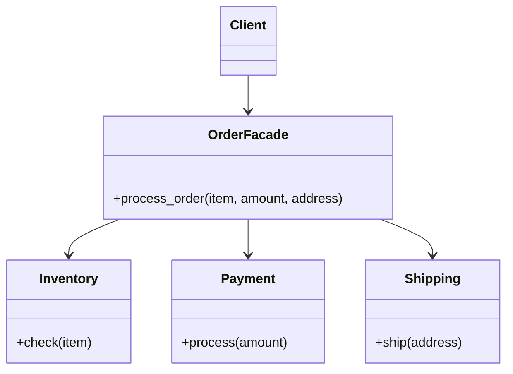
```mermaid
classDiagram
    class Client
    class OrderFacade {
        +process_order(item, amount, address)
    }
    class Inventory {
        +check(item)
    }
    class Payment {
        +process(amount)
    }
    class Shipping {
        +ship(address)
    }
    Client --> OrderFacade
    OrderFacade --> Inventory
    OrderFacade --> Payment
    OrderFacade --> Shipping
```


#### 2.2.6 Flyweight

The Flyweight pattern uses sharing to support large numbers of fine-grained objects efficiently. It's used to minimize memory usage or computational expenses by sharing as much as possible with similar objects.

**When to use**: Use the Flyweight pattern when your program must support a huge number of objects that barely fit into available RAM. The pattern is especially useful when many of these objects are similar and can share some common state.

**Example**: Let's implement a flyweight for managing product attributes in our e-commerce system.

```python
class ProductAttribute:
    def __init__(self, name, value):
        self.name = name
        self.value = value

class ProductAttributeFactory:
    def __init__(self):
        self._attributes = {}

    def get_attribute(self, name, value):
        key = f"{name}:{value}"
        if key not in self._attributes:
            self._attributes[key] = ProductAttribute(name, value)
        return self._attributes[key]

class Product:
    def __init__(self, name, attribute_factory):
        self.name = name
        self.attributes = []
        self.attribute_factory = attribute_factory

    def add_attribute(self, name, value):
        self.attributes.append(self.attribute_factory.get_attribute(name, value))

# Usage
factory = ProductAttributeFactory()

laptop = Product("Laptop", factory)
laptop.add_attribute("Color", "Silver")
laptop.add_attribute("RAM", "8GB")

smartphone = Product("Smartphone", factory)
smartphone.add_attribute("Color", "Black")
smartphone.add_attribute("Storage", "64GB")

# Check if the same attribute objects are reused
print(laptop.attributes[0] is smartphone.attributes[0])  # False
print(laptop.attributes[0].name, laptop.attributes[0].value)  # Color Silver
print(smartphone.attributes[0].name, smartphone.attributes[0].value)  # Color Black
```

In this example, the `ProductAttributeFactory` ensures that identical product attributes are only created once and shared among products. This can significantly reduce memory usage when dealing with a large number of products with similar attributes.

Here's a Mermaid diagram illustrating the Flyweight pattern:

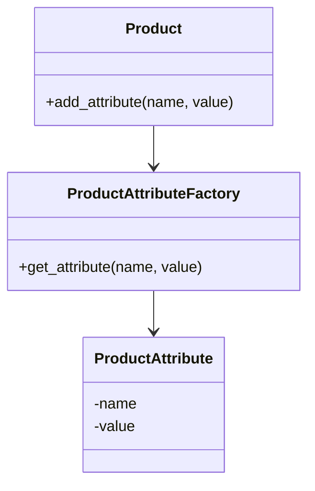
```mermaid
classDiagram
    class Product {
        +add_attribute(name, value)
    }
    class ProductAttributeFactory {
        +get_attribute(name, value)
    }
    class ProductAttribute {
        -name
        -value
    }
    Product --> ProductAttributeFactory
    ProductAttributeFactory --> ProductAttribute

```

#### 2.2.7 Proxy

The Proxy pattern provides a surrogate or placeholder for another object to control access to it. This can be useful for implementing lazy loading, access control, logging, or any other controlling behavior.

**When to use**: Use the Proxy pattern when you want to add a level of indirect access to an object to add additional functionality or control. Common scenarios include lazy loading of resource-heavy objects, access control, and logging.

**Example**: Let's implement a proxy for lazy loading of product images in our e-commerce system.

```python
from abc import ABC, abstractmethod

class Image(ABC):
    @abstractmethod
    def display(self):
        pass

class RealImage(Image):
    def __init__(self, filename):
        self.filename = filename
        self._load_image_from_disk()

    def _load_image_from_disk(self):
        print(f"Loading image: {self.filename}")

    def display(self):
        print(f"Displaying image: {self.filename}")

class ImageProxy(Image):
    def __init__(self, filename):
        self.filename = filename
        self.real_image = None

    def display(self):
        if self.real_image is None:
            self.real_image = RealImage(self.filename)
        self.real_image.display()

# Usage
image1 = ImageProxy("product1.jpg")
image2 = ImageProxy("product2.jpg")

print("Application started. Images not loaded yet.")

print("Displaying image 1:")
image1.display()

print("Displaying image 1 again:")
image1.display()

print("Displaying image 2:")
image2.display()
```

In this example, the `ImageProxy` acts as a surrogate for the `RealImage`. It delays the loading of the actual image until it's needed, which can be beneficial for performance, especially when dealing with many high-resolution product images.

Here's a Mermaid diagram illustrating the Proxy pattern:

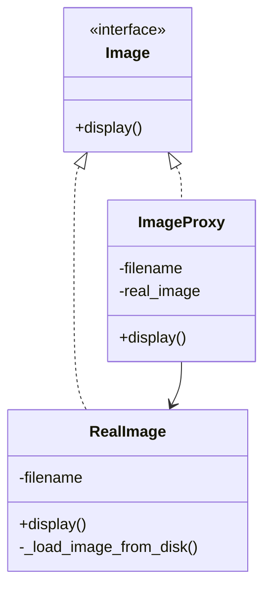
```mermaid
classDiagram
    class Image {
        <<interface>>
        +display()
    }
    class RealImage {
        -filename
        +display()
        -_load_image_from_disk()
    }
    class ImageProxy {
        -filename
        -real_image
        +display()
    }
    Image <|.. RealImage
    Image <|.. ImageProxy
    ImageProxy --> RealImage

```

### 2.3 Behavioral Patterns

Behavioral patterns are concerned with algorithms and the assignment of responsibilities between objects. They describe not just patterns of objects or classes but also the patterns of communication between them.

#### 2.3.1 Chain of Responsibility

The Chain of Responsibility pattern passes requests along a chain of handlers. Upon receiving a request, each handler decides either to process the request or to pass it to the next handler in the chain.

**When to use**: Use the Chain of Responsibility pattern when you want to give more than one object a chance to handle a request, or when you don't know beforehand which object should handle a request.

**Example**: Let's implement a chain of responsibility for handling customer support requests in our e-commerce system.

```python
from abc import ABC, abstractmethod

class SupportHandler(ABC):
    def __init__(self):
        self._next_handler = None

    def set_next(self, handler):
        self._next_handler = handler
        return handler

    @abstractmethod
    def handle(self, request):
        if self._next_handler:
            return self._next_handler.handle(request)
        return None

class GeneralSupport(SupportHandler):
    def handle(self, request):
        if request == "general":
            return f"General Support: I can help with general inquiries."
        return super().handle(request)

class TechnicalSupport(SupportHandler):
    def handle(self, request):
        if request == "technical":
            return f"Technical Support: I can help with technical issues."
        return super().handle(request)

class BillingSupport(SupportHandler):
    def handle(self, request):
        if request == "billing":
            return f"Billing Support: I can help with billing questions."
        return super().handle(request)

# Usage
general = GeneralSupport()
technical = TechnicalSupport()
billing = BillingSupport()

general.set_next(technical).set_next(billing)

print(general.handle("general"))
print(general.handle("technical"))
print(general.handle("billing"))
print(general.handle("unknown"))
```

In this example, customer support requests are passed along a chain of support handlers. Each handler checks if it can process the request, and if not, passes it to the next handler in the chain.

Here's a Mermaid diagram illustrating the Chain of Responsibility pattern:

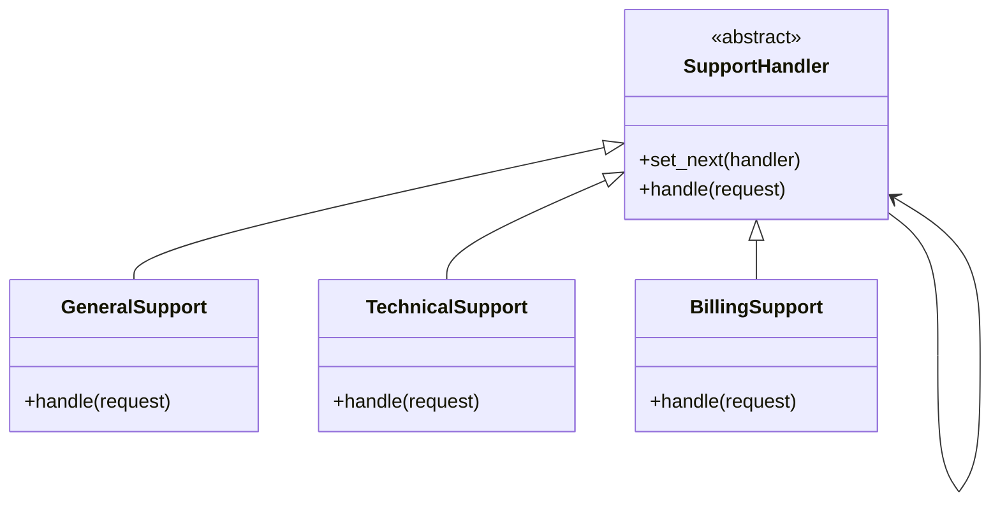
```mermaid
classDiagram
    class SupportHandler {
        <<abstract>>
        +set_next(handler)
        +handle(request)
    }
    class GeneralSupport {
        +handle(request)
    }
    class TechnicalSupport {
        +handle(request)
    }
    class BillingSupport {
        +handle(request)
    }
    SupportHandler <|-- GeneralSupport
    SupportHandler <|-- TechnicalSupport
    SupportHandler <|-- BillingSupport
    SupportHandler --> SupportHandler

```

This concludes our discussion of the Structural Patterns and introduces the first Behavioral Pattern. In the next part, we'll continue with more Behavioral Patterns, providing detailed explanations and examples in the context of our e-commerce system.

#### 2.3.2 Command

The Command pattern encapsulates a request as an object, thereby allowing for parameterization of clients with different requests, queue or log requests, and support undoable operations.

**When to use**: Use the Command pattern when you want to parametrize objects with operations, create queues of operations, or implement reversible operations.

**Example**: Let's implement a command pattern for managing shopping cart operations in our e-commerce system.

```python
from abc import ABC, abstractmethod

class Command(ABC):
    @abstractmethod
    def execute(self):
        pass

    @abstractmethod
    def undo(self):
        pass

class AddToCartCommand(Command):
    def __init__(self, cart, item):
        self.cart = cart
        self.item = item

    def execute(self):
        self.cart.add_item(self.item)

    def undo(self):
        self.cart.remove_item(self.item)

class RemoveFromCartCommand(Command):
    def __init__(self, cart, item):
        self.cart = cart
        self.item = item

    def execute(self):
        self.cart.remove_item(self.item)

    def undo(self):
        self.cart.add_item(self.item)

class ShoppingCart:
    def __init__(self):
        self.items = []

    def add_item(self, item):
        self.items.append(item)
        print(f"Added {item} to cart")

    def remove_item(self, item):
        if item in self.items:
            self.items.remove(item)
            print(f"Removed {item} from cart")
        else:
            print(f"{item} not in cart")

    def __str__(self):
        return f"Cart: {', '.join(self.items)}"

class OrderManager:
    def __init__(self):
        self.commands = []
        self.current_command = -1

    def execute(self, command):
        command.execute()
        self.commands = self.commands[:self.current_command + 1]
        self.commands.append(command)
        self.current_command += 1

    def undo(self):
        if self.current_command >= 0:
            command = self.commands[self.current_command]
            command.undo()
            self.current_command -= 1
        else:
            print("Nothing to undo")

    def redo(self):
        if self.current_command < len(self.commands) - 1:
            self.current_command += 1
            command = self.commands[self.current_command]
            command.execute()
        else:
            print("Nothing to redo")

# Usage
cart = ShoppingCart()
manager = OrderManager()

# Add items to cart
manager.execute(AddToCartCommand(cart, "Laptop"))
manager.execute(AddToCartCommand(cart, "Mouse"))
print(cart)

# Undo last action
manager.undo()
print(cart)

# Redo last action
manager.redo()
print(cart)

# Remove an item
manager.execute(RemoveFromCartCommand(cart, "Laptop"))
print(cart)

# Undo remove
manager.undo()
print(cart)
```

In this example, we've encapsulated shopping cart operations (add and remove) as Command objects. This allows us to easily implement undo and redo functionality for these operations.

Here's a Mermaid diagram illustrating the Command pattern:

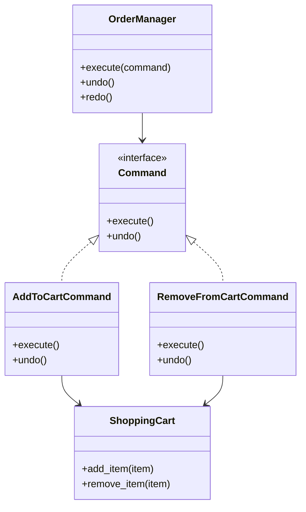
```mermaid
classDiagram
    class Command {
        <<interface>>
        +execute()
        +undo()
    }
    class AddToCartCommand {
        +execute()
        +undo()
    }
    class RemoveFromCartCommand {
        +execute()
        +undo()
    }
    class ShoppingCart {
        +add_item(item)
        +remove_item(item)
    }
    class OrderManager {
        +execute(command)
        +undo()
        +redo()
    }
    Command <|.. AddToCartCommand
    Command <|.. RemoveFromCartCommand
    AddToCartCommand --> ShoppingCart
    RemoveFromCartCommand --> ShoppingCart
    OrderManager --> Command
```

#### 2.3.3 Iterator

The Iterator pattern provides a way to access the elements of an aggregate object sequentially without exposing its underlying representation.

**When to use**: Use the Iterator pattern when you want to access a collection of objects without exposing its internal structure, or when you want to provide a uniform interface for traversing different types of collections.

**Example**: Let's implement an iterator for browsing products in different categories in our e-commerce system.

```python
from collections.abc import Iterable, Iterator

class Product:
    def __init__(self, name, price):
        self.name = name
        self.price = price

    def __str__(self):
        return f"{self.name} (${self.price})"

class ProductCategory(Iterable):
    def __init__(self, name):
        self.name = name
        self.products = []

    def add_product(self, product):
        self.products.append(product)

    def __iter__(self):
        return ProductIterator(self.products)

class ProductIterator(Iterator):
    def __init__(self, products):
        self._products = products
        self._index = 0

    def __next__(self):
        try:
            product = self._products[self._index]
            self._index += 1
            return product
        except IndexError:
            raise StopIteration()

# Usage
electronics = ProductCategory("Electronics")
electronics.add_product(Product("Laptop", 1000))
electronics.add_product(Product("Smartphone", 500))
electronics.add_product(Product("Tablet", 300))

clothing = ProductCategory("Clothing")
clothing.add_product(Product("T-Shirt", 20))
clothing.add_product(Product("Jeans", 50))

# Iterate over products in each category
for category in [electronics, clothing]:
    print(f"\nProducts in {category.name}:")
    for product in category:
        print(product)
```

In this example, we've implemented an iterator that allows us to traverse products within a category without exposing the internal structure of the category.

Here's a Mermaid diagram illustrating the Iterator pattern:

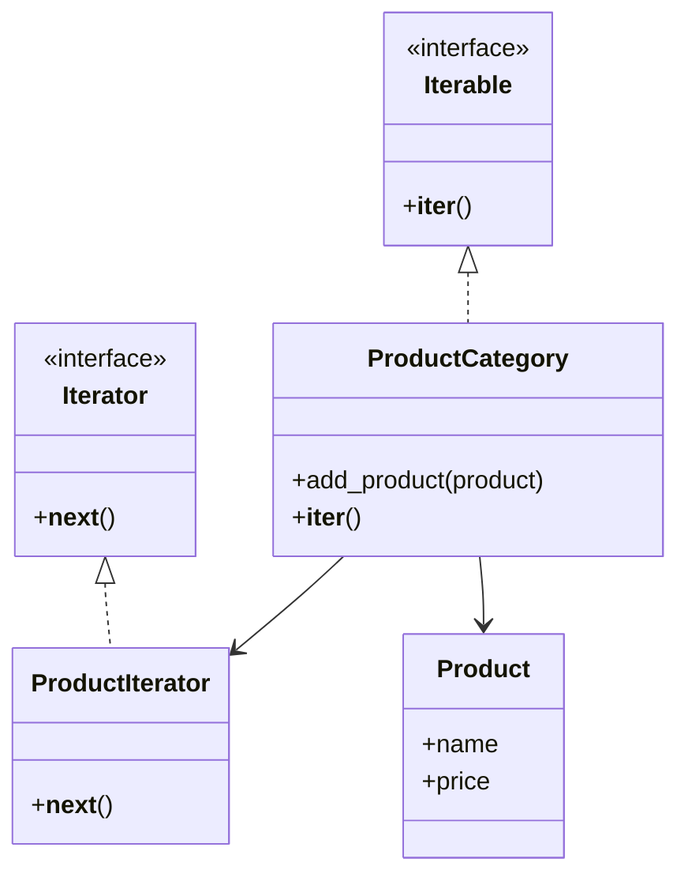
```mermaid
classDiagram
    class Iterable {
        <<interface>>
        +__iter__()
    }
    class Iterator {
        <<interface>>
        +__next__()
    }
    class ProductCategory {
        +add_product(product)
        +__iter__()
    }
    class ProductIterator {
        +__next__()
    }
    class Product {
        +name
        +price
    }
    Iterable <|.. ProductCategory
    Iterator <|.. ProductIterator
    ProductCategory --> ProductIterator
    ProductCategory --> Product

```

#### 2.3.4 Mediator

The Mediator pattern defines an object that encapsulates how a set of objects interact. It promotes loose coupling by keeping objects from referring to each other explicitly, allowing you to vary their interaction independently.

**When to use**: Use the Mediator pattern when you want to reduce chaotic dependencies between objects or when you want to reuse an object without complex dependencies.

**Example**: Let's implement a mediator for coordinating interactions between different components of our e-commerce checkout system.

```python
from abc import ABC, abstractmethod

class CheckoutComponent(ABC):
    def __init__(self, mediator=None):
        self._mediator = mediator

    @property
    def mediator(self):
        return self._mediator

    @mediator.setter
    def mediator(self, mediator):
        self._mediator = mediator

class Inventory(CheckoutComponent):
    def check_availability(self, product):
        print(f"Checking availability of {product}")
        is_available = True  # Simulated check
        self.mediator.notify(self, f"{product}:{'available' if is_available else 'unavailable'}")
        return is_available

class Payment(CheckoutComponent):
    def process_payment(self, amount):
        print(f"Processing payment of ${amount}")
        is_successful = True  # Simulated payment
        self.mediator.notify(self, f"payment:{'successful' if is_successful else 'failed'}")
        return is_successful

class Shipping(CheckoutComponent):
    def ship_order(self, order):
        print(f"Shipping order {order}")
        is_shipped = True  # Simulated shipping
        self.mediator.notify(self, f"order:{order}:{'shipped' if is_shipped else 'shipping_failed'}")
        return is_shipped

class CheckoutMediator:
    def __init__(self):
        self._inventory = Inventory(self)
        self._payment = Payment(self)
        self._shipping = Shipping(self)
        self._order_status = {'inventory': False, 'payment': False, 'shipping': False}

    def notify(self, sender, event):
        if ':' in event:
            event_type, status = event.split(':')
            if sender == self._inventory:
                self._order_status['inventory'] = (status == 'available')
            elif sender == self._payment:
                self._order_status['payment'] = (status == 'successful')
            elif sender == self._shipping:
                self._order_status['shipping'] = (status == 'shipped')

        if all(self._order_status.values()):
            print("Order completed successfully!")
        elif not self._order_status['inventory']:
            print("Order failed: Product not available")
        elif not self._order_status['payment']:
            print("Order failed: Payment unsuccessful")
        elif not self._order_status['shipping']:
            print("Order failed: Shipping unsuccessful")

    def place_order(self, product, amount):
        if self._inventory.check_availability(product):
            if self._payment.process_payment(amount):
                self._shipping.ship_order(product)

# Usage
mediator = CheckoutMediator()
mediator.place_order("Laptop", 1000)
```

In this example, the `CheckoutMediator` coordinates the interactions between the `Inventory`, `Payment`, and `Shipping` components during the checkout process. This reduces the dependencies between these components and allows for easier modification of the checkout process.

Here's a Mermaid diagram illustrating the Mediator pattern:

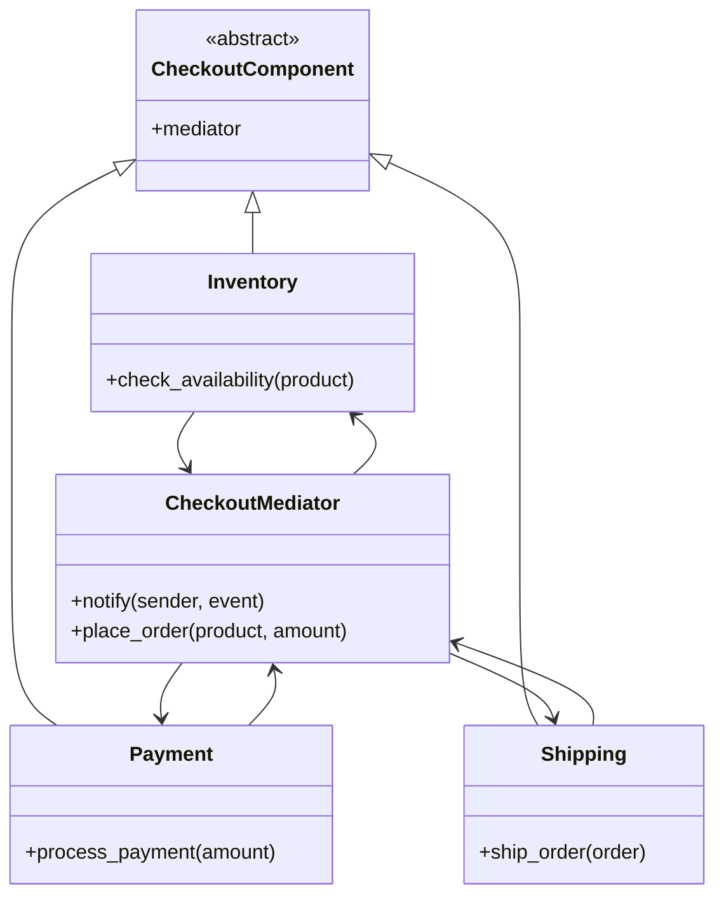
```mermaid
classDiagram
    class CheckoutComponent {
        <<abstract>>
        +mediator
    }
    class Inventory {
        +check_availability(product)
    }
    class Payment {
        +process_payment(amount)
    }
    class Shipping {
        +ship_order(order)
    }
    class CheckoutMediator {
        +notify(sender, event)
        +place_order(product, amount)
    }
    CheckoutComponent <|-- Inventory
    CheckoutComponent <|-- Payment
    CheckoutComponent <|-- Shipping
    CheckoutMediator --> Inventory
    CheckoutMediator --> Payment
    CheckoutMediator --> Shipping
    Inventory --> CheckoutMediator
    Payment --> CheckoutMediator
    Shipping --> CheckoutMediator

```

This concludes our discussion of the Command, Iterator, and Mediator patterns. In the next part, we'll continue with more Behavioral Patterns, providing detailed explanations and examples in the context of our e-commerce system.

#### 2.3.5 Memento

The Memento pattern captures and externalizes an object's internal state so that the object can be restored to this state later, without violating encapsulation.

**When to use**: Use the Memento pattern when you need to create snapshots of an object's state to restore it later, or when direct access to an object's fields/getters/setters violates its encapsulation.

**Example**: Let's implement a memento for saving and restoring shopping cart states in our e-commerce system.

```python
from copy import deepcopy

class CartItem:
    def __init__(self, name, price):
        self.name = name
        self.price = price

class ShoppingCartMemento:
    def __init__(self, items):
        self._items = deepcopy(items)

    def get_saved_state(self):
        return self._items

class ShoppingCart:
    def __init__(self):
        self._items = []

    def add_item(self, item):
        self._items.append(item)

    def remove_item(self, item):
        self._items.remove(item)

    def save(self):
        return ShoppingCartMemento(self._items)

    def restore(self, memento):
        self._items = memento.get_saved_state()

    def __str__(self):
        return f"Cart: {', '.join(item.name for item in self._items)}"

class ShoppingSession:
    def __init__(self):
        self._history = []

    def add_memento(self, memento):
        self._history.append(memento)

    def get_memento(self, index):
        return self._history[index]

# Usage
cart = ShoppingCart()
session = ShoppingSession()

# Add items and save state
cart.add_item(CartItem("Laptop", 1000))
session.add_memento(cart.save())

cart.add_item(CartItem("Mouse", 50))
session.add_memento(cart.save())

cart.add_item(CartItem("Keyboard", 100))
print(cart)  # Cart: Laptop, Mouse, Keyboard

# Restore to previous state
cart.restore(session.get_memento(1))
print(cart)  # Cart: Laptop, Mouse

# Restore to original state
cart.restore(session.get_memento(0))
print(cart)  # Cart: Laptop
```

In this example, the `ShoppingCartMemento` captures the state of the `ShoppingCart` at a given point in time. The `ShoppingSession` acts as a caretaker, storing and managing the mementos. This allows us to save and restore shopping cart states without exposing the cart's internal structure.

Here's a Mermaid diagram illustrating the Memento pattern:


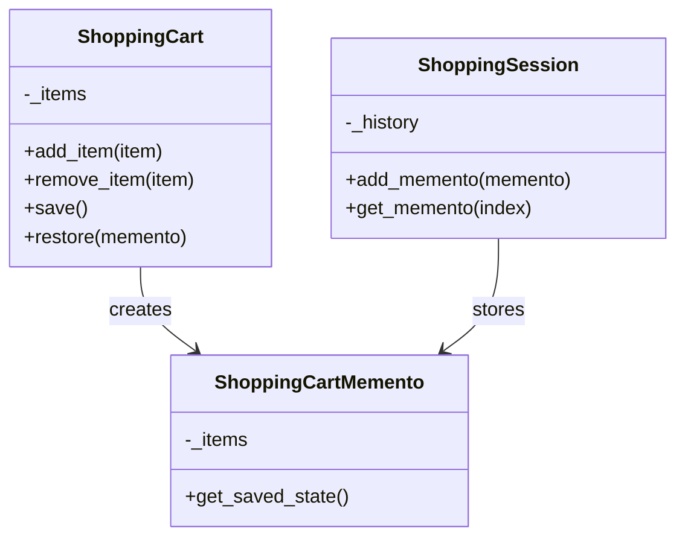
```mermaid
classDiagram
    class ShoppingCart {
        -_items
        +add_item(item)
        +remove_item(item)
        +save()
        +restore(memento)
    }
    class ShoppingCartMemento {
        -_items
        +get_saved_state()
    }
    class ShoppingSession {
        -_history
        +add_memento(memento)
        +get_memento(index)
    }
    ShoppingCart --> ShoppingCartMemento : creates
    ShoppingSession --> ShoppingCartMemento : stores
```

#### 2.3.6 Observer

The Observer pattern defines a one-to-many dependency between objects so that when one object changes state, all its dependents are notified and updated automatically.

**When to use**: Use the Observer pattern when changes to the state of one object may require changing other objects, and the actual set of objects is unknown beforehand or changes dynamically.

**Example**: Let's implement an observer pattern for notifying customers about product price changes in our e-commerce system.

```python
from abc import ABC, abstractmethod

class Subject(ABC):
    @abstractmethod
    def attach(self, observer):
        pass

    @abstractmethod
    def detach(self, observer):
        pass

    @abstractmethod
    def notify(self):
        pass

class ProductCatalog(Subject):
    def __init__(self):
        self._observers = []
        self._products = {}

    def attach(self, observer):
        self._observers.append(observer)

    def detach(self, observer):
        self._observers.remove(observer)

    def notify(self):
        for observer in self._observers:
            observer.update(self)

    def add_product(self, name, price):
        self._products[name] = price
        self.notify()

    def update_price(self, name, price):
        self._products[name] = price
        self.notify()

    def get_price(self, name):
        return self._products.get(name)

class Observer(ABC):
    @abstractmethod
    def update(self, subject):
        pass

class Customer(Observer):
    def __init__(self, name):
        self.name = name

    def update(self, subject):
        print(f"{self.name} notified: Product catalog has been updated.")

# Usage
catalog = ProductCatalog()

alice = Customer("Alice")
bob = Customer("Bob")

catalog.attach(alice)
catalog.attach(bob)

catalog.add_product("Laptop", 1000)
# Output:
# Alice notified: Product catalog has been updated.
# Bob notified: Product catalog has been updated.

catalog.update_price("Laptop", 900)
# Output:
# Alice notified: Product catalog has been updated.
# Bob notified: Product catalog has been updated.

catalog.detach(bob)

catalog.add_product("Smartphone", 500)
# Output:
# Alice notified: Product catalog has been updated.
```

In this example, the `ProductCatalog` acts as the subject, and `Customer` objects are observers. Whenever the product catalog is updated, all attached customers are notified automatically.

Here's a Mermaid diagram illustrating the Observer pattern:

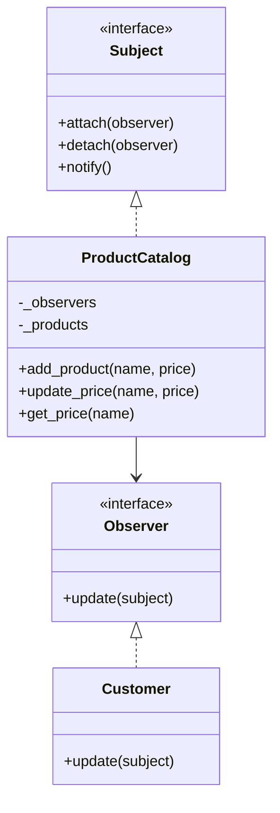
```mermaid
classDiagram
    class Subject {
        <<interface>>
        +attach(observer)
        +detach(observer)
        +notify()
    }
    class ProductCatalog {
        -_observers
        -_products
        +add_product(name, price)
        +update_price(name, price)
        +get_price(name)
    }
    class Observer {
        <<interface>>
        +update(subject)
    }
    class Customer {
        +update(subject)
    }
    Subject <|.. ProductCatalog
    Observer <|.. Customer
    ProductCatalog --> Observer

```

#### 2.3.7 State

The State pattern allows an object to alter its behavior when its internal state changes. The object will appear to change its class.

**When to use**: Use the State pattern when you have an object that behaves differently depending on its current state, the number of states is enormous, and the state-specific code changes frequently.

**Example**: Let's implement a state pattern for managing order states in our e-commerce system.

```python
from abc import ABC, abstractmethod

class OrderState(ABC):
    @abstractmethod
    def process(self, order):
        pass

class NewOrder(OrderState):
    def process(self, order):
        print("Processing new order...")
        order.state = PaymentPending()

class PaymentPending(OrderState):
    def process(self, order):
        print("Processing payment...")
        order.state = Shipped()

class Shipped(OrderState):
    def process(self, order):
        print("Order shipped.")
        order.state = Delivered()

class Delivered(OrderState):
    def process(self, order):
        print("Order delivered.")

class Order:
    def __init__(self):
        self.state = NewOrder()

    def process(self):
        self.state.process(self)

# Usage
order = Order()

order.process()  # Output: Processing new order...
order.process()  # Output: Processing payment...
order.process()  # Output: Order shipped.
order.process()  # Output: Order delivered.
```

In this example, the `Order` class delegates the processing behavior to its current state object. As the order is processed, its state changes, and its behavior changes accordingly without changing the `Order` class itself.

Here's a Mermaid diagram illustrating the State pattern:

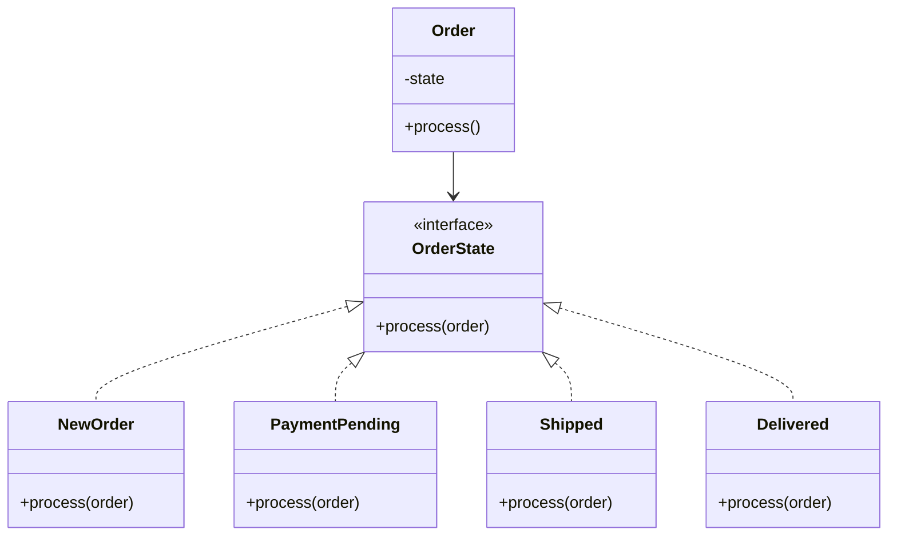
```mermaid
classDiagram
    class OrderState {
        <<interface>>
        +process(order)
    }
    class NewOrder {
        +process(order)
    }
    class PaymentPending {
        +process(order)
    }
    class Shipped {
        +process(order)
    }
    class Delivered {
        +process(order)
    }
    class Order {
        -state
        +process()
    }
    OrderState <|.. NewOrder
    OrderState <|.. PaymentPending
    OrderState <|.. Shipped
    OrderState <|.. Delivered
    Order --> OrderState

```

#### 2.3.8 Strategy

The Strategy pattern defines a family of algorithms, encapsulates each one, and makes them interchangeable. It lets the algorithm vary independently from clients that use it.

**When to use**: Use the Strategy pattern when you want to define a class that will have one behavior that is similar to other behaviors in a list, or when you need to use one of several behaviors dynamically.

**Example**: Let's implement a strategy pattern for different pricing strategies in our e-commerce system.

```python
from abc import ABC, abstractmethod

class PricingStrategy(ABC):
    @abstractmethod
    def calculate_price(self, base_price):
        pass

class RegularPricing(PricingStrategy):
    def calculate_price(self, base_price):
        return base_price

class DiscountPricing(PricingStrategy):
    def __init__(self, discount_percentage):
        self.discount_percentage = discount_percentage

    def calculate_price(self, base_price):
        return base_price * (1 - self.discount_percentage / 100)

class SalePricing(PricingStrategy):
    def __init__(self, sale_price):
        self.sale_price = sale_price

    def calculate_price(self, base_price):
        return min(base_price, self.sale_price)

class Product:
    def __init__(self, name, base_price):
        self.name = name
        self.base_price = base_price
        self.pricing_strategy = RegularPricing()

    def set_pricing_strategy(self, pricing_strategy):
        self.pricing_strategy = pricing_strategy

    def get_price(self):
        return self.pricing_strategy.calculate_price(self.base_price)

# Usage
laptop = Product("Laptop", 1000)

print(f"Regular price: ${laptop.get_price()}")

laptop.set_pricing_strategy(DiscountPricing(20))
print(f"20% discount price: ${laptop.get_price()}")

laptop.set_pricing_strategy(SalePricing(700))
print(f"Sale price: ${laptop.get_price()}")
```

In this example, we define different pricing strategies (regular, discount, sale) and can switch between them dynamically for each product. This allows for flexible pricing without changing the `Product` class.

Here's a Mermaid diagram illustrating the Strategy pattern:

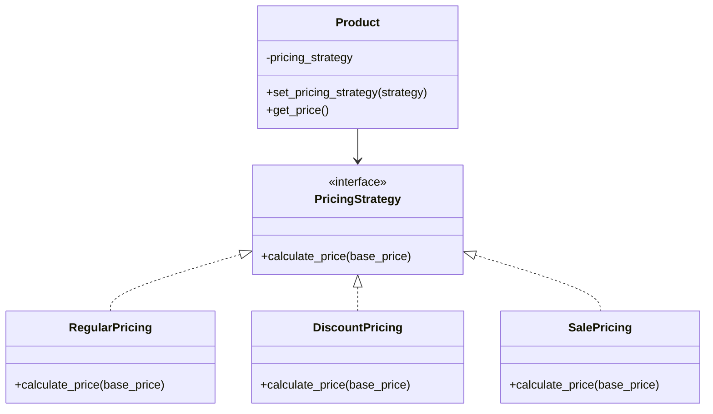
```mermaid
classDiagram
    class PricingStrategy {
        <<interface>>
        +calculate_price(base_price)
    }
    class RegularPricing {
        +calculate_price(base_price)
    }
    class DiscountPricing {
        +calculate_price(base_price)
    }
    class SalePricing {
        +calculate_price(base_price)
    }
    class Product {
        -pricing_strategy
        +set_pricing_strategy(strategy)
        +get_price()
    }
    PricingStrategy <|.. RegularPricing
    PricingStrategy <|.. DiscountPricing
    PricingStrategy <|.. SalePricing
    Product --> PricingStrategy

```

This concludes our discussion of the Memento, Observer, State, and Strategy patterns. In the next and final part, we'll cover the Template Method and Visitor patterns, and then move on to the remaining sections of our comprehensive guide.

#### 2.3.9 Template Method

The Template Method pattern defines the skeleton of an algorithm in the superclass but lets subclasses override specific steps of the algorithm without changing its structure.

**When to use**: Use the Template Method pattern when you want to let clients extend only particular steps of an algorithm, but not the whole algorithm or its structure.

**Example**: Let's implement a template method for processing different types of orders in our e-commerce system.

```python
from abc import ABC, abstractmethod

class OrderProcessor(ABC):
    def process_order(self):
        self.validate_order()
        self.calculate_total()
        self.apply_discounts()
        self.charge_payment()
        self.send_confirmation()

    @abstractmethod
    def validate_order(self):
        pass

    @abstractmethod
    def calculate_total(self):
        pass

    def apply_discounts(self):
        print("Applying standard discounts")

    @abstractmethod
    def charge_payment(self):
        pass

    def send_confirmation(self):
        print("Sending order confirmation email")

class PhysicalProductOrder(OrderProcessor):
    def validate_order(self):
        print("Validating physical product order")

    def calculate_total(self):
        print("Calculating total (including shipping)")

    def charge_payment(self):
        print("Charging payment for physical product")

class DigitalProductOrder(OrderProcessor):
    def validate_order(self):
        print("Validating digital product order")

    def calculate_total(self):
        print("Calculating total (no shipping)")

    def charge_payment(self):
        print("Charging payment for digital product")

    def apply_discounts(self):
        print("Applying digital product discounts")

# Usage
physical_order = PhysicalProductOrder()
digital_order = DigitalProductOrder()

print("Processing physical product order:")
physical_order.process_order()

print("\nProcessing digital product order:")
digital_order.process_order()
```

In this example, `OrderProcessor` defines the template method `process_order()`, which outlines the steps for processing an order. The subclasses `PhysicalProductOrder` and `DigitalProductOrder` provide specific implementations for some of these steps while reusing the common structure.

Here's a Mermaid diagram illustrating the Template Method pattern:


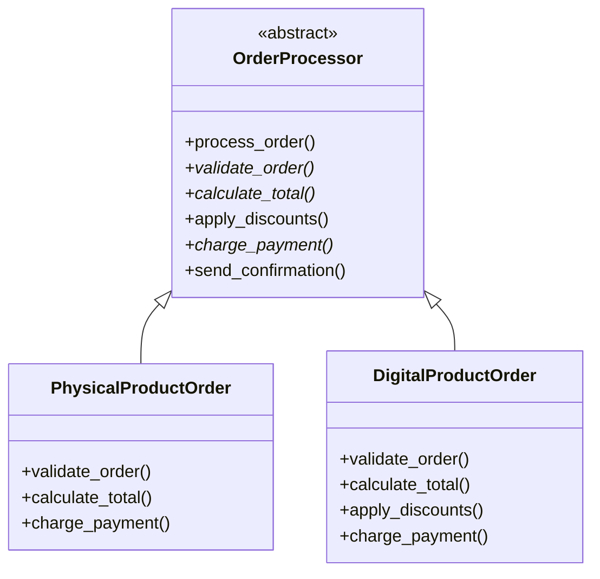
```mermaid
classDiagram
    class OrderProcessor {
        <<abstract>>
        +process_order()
        +validate_order()*
        +calculate_total()*
        +apply_discounts()
        +charge_payment()*
        +send_confirmation()
    }
    class PhysicalProductOrder {
        +validate_order()
        +calculate_total()
        +charge_payment()
    }
    class DigitalProductOrder {
        +validate_order()
        +calculate_total()
        +apply_discounts()
        +charge_payment()
    }
    OrderProcessor <|-- PhysicalProductOrder
    OrderProcessor <|-- DigitalProductOrder
```

#### 2.3.10 Visitor

The Visitor pattern represents an operation to be performed on the elements of an object structure. It lets you define a new operation without changing the classes of the elements on which it operates.

**When to use**: Use the Visitor pattern when you want to perform operations on all elements of a complex object structure (like a composite tree) and you want to avoid "polluting" the classes with these operations.

**Example**: Let's implement a visitor pattern for calculating shipping costs for different types of products in our e-commerce system.

```python
from abc import ABC, abstractmethod

class Product(ABC):
    def __init__(self, name, weight):
        self.name = name
        self.weight = weight

    @abstractmethod
    def accept(self, visitor):
        pass

class Book(Product):
    def accept(self, visitor):
        return visitor.visit_book(self)

class Electronics(Product):
    def accept(self, visitor):
        return visitor.visit_electronics(self)

class Clothing(Product):
    def accept(self, visitor):
        return visitor.visit_clothing(self)

class ShippingCostVisitor(ABC):
    @abstractmethod
    def visit_book(self, book):
        pass

    @abstractmethod
    def visit_electronics(self, electronics):
        pass

    @abstractmethod
    def visit_clothing(self, clothing):
        pass

class DomesticShippingVisitor(ShippingCostVisitor):
    def visit_book(self, book):
        return book.weight * 1

    def visit_electronics(self, electronics):
        return electronics.weight * 1.5

    def visit_clothing(self, clothing):
        return clothing.weight * 0.5

class InternationalShippingVisitor(ShippingCostVisitor):
    def visit_book(self, book):
        return book.weight * 5

    def visit_electronics(self, electronics):
        return electronics.weight * 7

    def visit_clothing(self, clothing):
        return clothing.weight * 3

# Usage
products = [
    Book("Python Design Patterns", 1),
    Electronics("Laptop", 3),
    Clothing("T-Shirt", 0.5)
]

domestic_visitor = DomesticShippingVisitor()
international_visitor = InternationalShippingVisitor()

print("Domestic Shipping Costs:")
for product in products:
    cost = product.accept(domestic_visitor)
    print(f"{product.name}: ${cost}")

print("\nInternational Shipping Costs:")
for product in products:
    cost = product.accept(international_visitor)
    print(f"{product.name}: ${cost}")
```

In this example, we use the Visitor pattern to calculate shipping costs for different types of products. The `ShippingCostVisitor` defines the interface for our visitors, and we have two concrete visitors: `DomesticShippingVisitor` and `InternationalShippingVisitor`. This allows us to add new operations (like different shipping methods) without modifying the product classes.

Here's a Mermaid diagram illustrating the Visitor pattern:

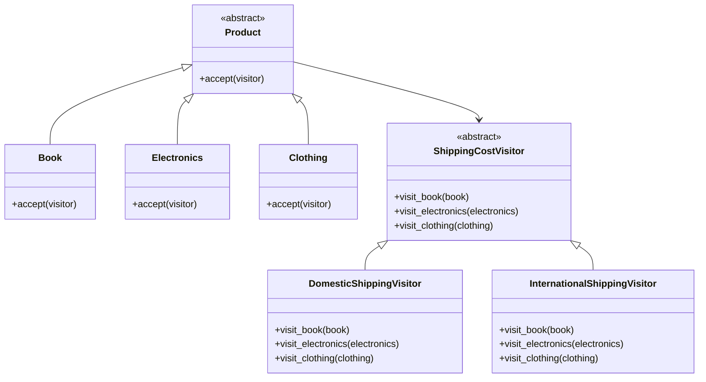
```mermaid
classDiagram
    class Product {
        <<abstract>>
        +accept(visitor)
    }
    class Book {
        +accept(visitor)
    }
    class Electronics {
        +accept(visitor)
    }
    class Clothing {
        +accept(visitor)
    }
    class ShippingCostVisitor {
        <<abstract>>
        +visit_book(book)
        +visit_electronics(electronics)
        +visit_clothing(clothing)
    }
    class DomesticShippingVisitor {
        +visit_book(book)
        +visit_electronics(electronics)
        +visit_clothing(clothing)
    }
    class InternationalShippingVisitor {
        +visit_book(book)
        +visit_electronics(electronics)
        +visit_clothing(clothing)
    }
    Product <|-- Book
    Product <|-- Electronics
    Product <|-- Clothing
    ShippingCostVisitor <|-- DomesticShippingVisitor
    ShippingCostVisitor <|-- InternationalShippingVisitor
    Product --> ShippingCostVisitor
```

## 3. Design Patterns in the Software Development Lifecycle

Design patterns play crucial roles throughout the software development lifecycle. Let's explore how different patterns can be applied in various phases of development in an e-commerce context.

### 3.1 Analysis and Planning Phase

During this phase, we focus on understanding requirements and planning the system architecture. Relevant patterns include:

1. **Strategy**: For planning different algorithms or business rules that might change, such as pricing strategies or shipping cost calculations.

2. **Observer**: For planning how different parts of the system will react to changes, like updating the UI when the shopping cart changes.

3. **Factory Method**: For planning creation of different types of objects, such as various types of user accounts or product categories.

### 3.2 Design Phase

In the design phase, we create the blueprint for the system. Useful patterns include:

1. **Singleton**: For designing global objects like a database connection pool or a configuration manager.

2. **Facade**: For designing simplified interfaces to complex subsystems, such as an order processing system that coordinates multiple backend services.

3. **Composite**: For designing hierarchical structures like product categories or nested comments on product reviews.

### 3.3 Implementation Phase

During implementation, we turn our designs into code. Relevant patterns include:

1. **Builder**: For implementing complex object construction, like customizable product configurations.

2. **Decorator**: For adding features to objects dynamically, such as adding gift wrapping to an order.

3. **Chain of Responsibility**: For implementing sequences of handlers, like different stages of order processing.

### 3.4 Maintenance and Extension Phase

As the system evolves, we need to maintain and extend it. Useful patterns include:

1. **Adapter**: For integrating new components or third-party services without changing existing code.

2. **State**: For managing complex state transitions, like order status changes.

3. **Visitor**: For adding new operations to existing object structures without modifying them, such as new ways to calculate shipping costs.

## 4. Implementing Design Patterns

When implementing design patterns, consider the following steps:

1. **Identify the Problem**: Understand the design issue you're trying to solve. For example, in an e-commerce system, you might need to implement different payment methods.

2. **Choose the Appropriate Pattern**: Select a pattern that addresses your specific problem. In the payment method example, the Strategy pattern could be a good fit.

3. **Adapt the Pattern**: Modify the pattern to fit your specific use case. You might need to adjust the Strategy pattern to handle different payment gateways.

4. **Implement the Pattern**: Write the code, following the structure of the chosen pattern. Create interfaces and classes for different payment strategies.

5. **Test and Refine**: Ensure the implementation solves the problem and refine as needed. Test with different payment methods and refine the implementation based on real-world scenarios.

Remember, while design patterns are powerful tools, they should not be forced into situations where they're not needed. Always prioritize clean, readable, and maintainable code.

## 5. Anti-Patterns

Anti-patterns are common responses to recurring problems that are usually ineffective and risk being highly counterproductive. In e-commerce systems, some common anti-patterns include:

1. **God Object**: An object that knows about and does too much. For example, a single `EcommerceSystem` class that handles products, orders, users, and payments.

2. **Spaghetti Code**: Code with a complex and tangled control structure. This could happen in complex checkout processes with many interdependencies.

3. **Golden Hammer**: Assuming that a favorite solution is universally applicable. For instance, using a NoSQL database for all data storage needs in an e-commerce system, even when some data is highly relational.

4. **Premature Optimization**: Optimizing before you know that you need to. This could involve spending time optimizing product search algorithms before understanding actual usage patterns.

5. **Reinventing the Wheel**: Failing to adopt an existing, adequate solution. For example, building a custom payment processing system from scratch instead of using established and secure third-party solutions.

Awareness of these anti-patterns can help developers avoid common pitfalls in software design.

## 6. Best Practices

When working with design patterns in e-commerce systems, keep these best practices in mind:

1. **Understand the Problem**: Ensure you fully understand the problem before applying a pattern. For example, understand the complexities of your product catalog before deciding on a structure.

2. **Keep It Simple**: Don't over-engineer. Use the simplest solution that solves the problem. A simple list might be sufficient for a small number of products, rather than a complex Composite pattern.

3. **Consider Maintainability**: Choose patterns that make your code easier to maintain and understand. This is crucial in e-commerce systems that often require frequent updates.

4. **Document Your Patterns**: Clearly document which patterns you're using and why. This helps other developers (or future you) understand the system's architecture.

5. **Be Consistent**: Use patterns consistently throughout your codebase. If you use the Strategy pattern for payment methods, consider using it for shipping methods too.

6. **Stay Flexible**: Be prepared to change or remove a pattern if it no longer fits your needs. As your e-commerce system grows, your initial patterns might need to evolve.

7. **Learn from Others**: Study how experienced developers use patterns in real-world e-commerce projects. Many open-source e-commerce platforms can serve as excellent learning resources.

## 7. Glossary

- **Abstraction**: Hiding the complex reality while exposing only the necessary parts. In e-commerce, this could involve creating a `Payment` interface that abstracts away the details of different payment methods.

- **Coupling**: The degree of interdependence between software modules. Low coupling is desirable for maintainable e-commerce systems.

- **Cohesion**: The degree to which the elements of a module belong together. High cohesion is desirable, such as grouping all product-related functionality in a single module.

- **SOLID Principles**: 
  - Single Responsibility: A class should have only one reason to change. For example, separate classes for order processing and invoice generation.
  - Open-Closed: Software entities should be open for extension, but closed for modification. Use interfaces to allow new payment methods without changing existing code.
  - Liskov Substitution: Objects of a superclass should be replaceable with objects of its subclasses without breaking the application. All product types should be usable wherever a general `Product` is expected.
  - Interface Segregation: Many client-specific interfaces are better than one general-purpose interface. Separate interfaces for product browsing and product management.
  - Dependency Inversion: Depend on abstractions, not concretions. Use a `PaymentProcessor` interface rather than concrete payment classes directly.

- **Inheritance**: A mechanism where you can derive a class from another class for a hierarchy of classes that share a set of attributes and methods. For example, different types of products inheriting from a base `Product` class.

- **Polymorphism**: The provision of a single interface to entities of different types. For instance, different types of discounts (percentage-based, fixed amount) can all implement a common `apply_discount` method.

- **Encapsulation**: Bundling of data with the methods that operate on that data. For example, a `ShoppingCart` class that contains items and methods to add/remove items, hiding the internal representation of the cart.

- **Composition**: A way to combine objects or data types into more complex ones. In e-commerce, an `Order` class might be composed of `Customer`, `ShoppingCart`, and `PaymentInfo` objects.

- **Delegation**: An object handling a request by delegating operations to a second object (the delegate). For instance, a `PaymentProcessor` class might delegate the actual payment processing to specific payment gateway classes.

- **Loose Coupling**: A design goal that seeks to reduce the inter-dependencies between components of a system. In an e-commerce context, this could mean designing the order processing system to work with any payment gateway that implements a common interface.

- **High Cohesion**: A measure of how strongly related and focused the various responsibilities of a software module are. For example, a `ProductCatalog` class should only contain methods related to managing and querying products, not handling user authentication or order processing.

- **Inversion of Control**: A design principle in which custom-written portions of a computer program receive the flow of control from a generic framework. In e-commerce, this could be seen in how a web framework calls custom controllers to handle specific routes.

- **Dependency Injection**: A technique whereby one object supplies the dependencies of another object. For example, injecting a `DatabaseConnection` object into a `ProductRepository` instead of having the repository create its own connection.

- **Interface**: A contract specifying a set of method signatures. In an e-commerce system, you might have a `ShippingProvider` interface that all specific shipping methods (like `StandardShipping`, `ExpressShipping`) must implement.

- **Abstract Class**: A class that cannot be instantiated and is often used to define a base set of behaviors that concrete subclasses must implement. For instance, an abstract `Product` class might define common attributes and methods that specific product types (`DigitalProduct`, `PhysicalProduct`) must implement.

- **Concrete Class**: A class that can be instantiated and typically implements one or more interfaces or extends an abstract class. In our e-commerce context, `CreditCardPayment` could be a concrete class implementing the `PaymentMethod` interface.

- **Factory**: An object for creating other objects. In e-commerce, a `ProductFactory` might be responsible for creating different types of product objects based on input parameters.

- **Singleton**: A class that allows only one instance of itself to be created. In an e-commerce application, this could be used for a `DatabaseConnection` or `ConfigurationManager` to ensure only one instance is used throughout the application.

- **Decorator**: A way to add behavior to individual objects dynamically without affecting the behavior of other objects from the same class. In e-commerce, this could be used to add gift wrapping or express shipping to an order.

- **Observer**: A pattern where an object, called the subject, maintains a list of its dependents, called observers, and notifies them automatically of any state changes. This could be used to notify various parts of the system (inventory, analytics, etc.) when an order is placed.

- **Strategy**: Defines a family of algorithms, encapsulates each one, and makes them interchangeable. In e-commerce, this could be used for implementing different pricing strategies or shipping cost calculations.

- **Template Method**: Defines the program skeleton of an algorithm in a method, deferring some steps to subclasses. For example, a base `OrderProcessor` class might define the overall flow of order processing, with specific steps implemented by subclasses for different types of orders.

- **Command**: Encapsulates a request as an object, thereby letting you parameterize clients with different requests, queue or log requests, and support undoable operations. In e-commerce, this could be used to implement a queue of order processing tasks.

- **State**: Allows an object to alter its behavior when its internal state changes. In an e-commerce system, this could be used to manage the different states of an order (New, Paid, Shipped, Delivered, etc.).

- **Proxy**: Provides a surrogate or placeholder for another object to control access to it. In e-commerce, this could be used to implement lazy loading of product images or to control access to sensitive customer information.

- **Facade**: Provides a unified interface to a set of interfaces in a subsystem. In an e-commerce context, this could be used to provide a simple `CheckoutProcess` facade that coordinates interactions between `ShoppingCart`, `PaymentProcessor`, and `OrderFulfillment` subsystems.

- **Flyweight**: Uses sharing to support large numbers of fine-grained objects efficiently. This could be used in an e-commerce system to efficiently manage a large catalog of products that share many common attributes.

- **Bridge**: Decouples an abstraction from its implementation so that the two can vary independently. In e-commerce, this could be used to separate the abstraction of a `PaymentProcessor` from its implementation for different payment gateways.

- **Composite**: Composes objects into tree structures to represent part-whole hierarchies. This is often used in e-commerce to represent product categories and subcategories.

- **Memento**: Without violating encapsulation, captures and externalizes an object's internal state so that the object can be restored to this state later. In an e-commerce application, this could be used to implement "save for later" functionality in a shopping cart.

- **Chain of Responsibility**: Passes a request along a chain of handlers. Upon receiving a request, each handler decides either to process the request or to pass it to the next handler in the chain. This could be used in processing an order through various stages of validation, payment processing, and fulfillment.

- **Visitor**: Represents an operation to be performed on the elements of an object structure. In e-commerce, this could be used to apply different operations (like price calculation, tax calculation, shipping cost calculation) on different types of products without changing the product classes.

By understanding and applying these concepts and patterns, developers can create more robust, flexible, and maintainable e-commerce systems. Remember, the key is not to use patterns everywhere, but to apply them judiciously where they solve specific design problems and improve the overall quality of the software.