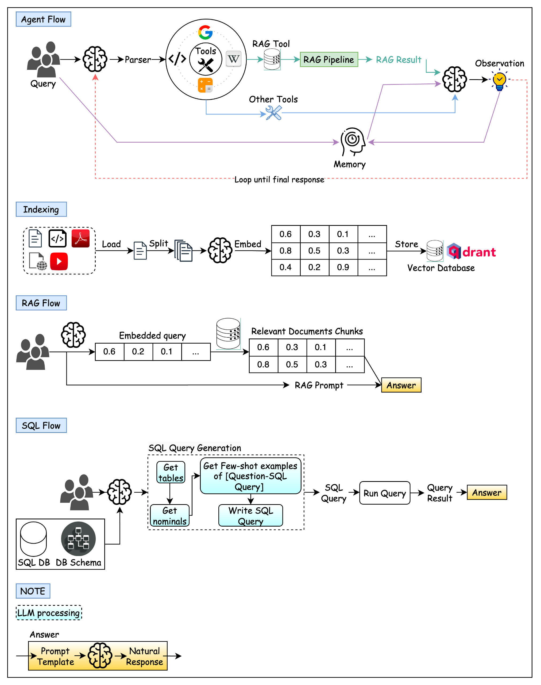
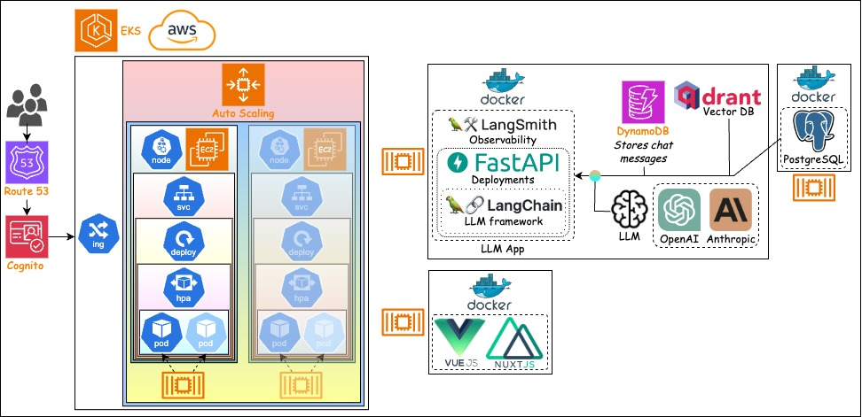

# Large Languge Model-powered applications

## App Logic



## System Architecture



## System Setting

### Environment Variables

```bash
# Models
OPENAI_API_KEY = 
COHERE_API_KEY = 
ANTHROPIC_API_KEY = 
GROQ_API_KEY = 

REPLICATE_API_TOKEN = 

LANGCHAIN_TRACING_V2 = 
LANGCHAIN_API_KEY = 
USER_AGENT = MyUserAgent

AWS_ACCESS_KEY_ID = 
AWS_SECRET_ACCESS_KEY = 
AWS_DEFAULT_REGION = 

# Tools
TAVILY_API_KEY = 
SERPER_API_KEY = 

# DBs
MSG_STORAGE_PROVIDER = mongodb # mongodb, dynamodb !!!

QDRANT_HOST = 
QDRANT_API_KEY = 

## Postgres
SQL_DB = mydatabase
SQL_HOST = 127.0.0.1
SQL_PORT = 5432
SQL_USER = myuser
SQL_PASSWORD = mysecretpassword

NEON_URI = 
SQL_DB_NEON = mydatabase
SQL_HOST_NEON = 
SQL_PORT_NEON = 5432
SQL_USER_NEON = my-default-db_owner
SQL_PASSWORD_NEON = 

## MongoDb
MONGODB_ATLAS_CLUSTER_URI = 
MONGODB_DB_NAME = "db_langchain"
MONGODB_COLLECTION_NAME_RAG = "coll_rag_langchain"
MONGODB_COLLECTION_NAME_MSG = "coll_msg_langchain"

```

### AWS

```bash
aws configure
```

```python
# Create DynamoDB table

import boto3

dynamodb = boto3.resource("dynamodb")

table = dynamodb.create_table(
  TableName="LangChainSessionTable",
  KeySchema=[
    { "AttributeName": "SessionId", "KeyType": "HASH" },
    { "AttributeName": "UserId", "KeyType": "RANGE" },
  ],
  AttributeDefinitions=[
    { "AttributeName": "SessionId", "AttributeType": "S" },
    { "AttributeName": "UserId", "AttributeType": "S" },
  ],
  BillingMode="PAY_PER_REQUEST",
)

# Wait until the table exists
table.meta.client.get_waiter("table_exists").wait(TableName="LangChainSessionTable")
```

## Deployment

### Postgres

Put data into container

- Start Postgres container. Do your work ...

```bash
docker compose -f DevOps/Docker/postgres.docker-compose.yaml up -d
docker compose -f DevOps/Docker/postgres.docker-compose.yaml down
```

- Dump data, get data.sql file in local

```bash
docker exec -it postgres  /bin/bash
pg_dump -U myuser -d mydatabase > /var/lib/postgresql/data/data.sql
exit

cp Apps/data/postgres/data.sql Apps/data/data.sql # No need
rm ./data.sql # No need
```

### Build Docker

```bash
docker build -t doantronghieu/custom-llm-fastapi:latest -f DevOps/Docker/custom/Dockerfile.fastapi.custom .
docker build -t doantronghieu/custom-llm-nuxtjs:latest -f DevOps/Docker/custom/Dockerfile.nuxtjs.custom .
docker build -t doantronghieu/custom-llm-postgresql:latest -f DevOps/Docker/custom/Dockerfile.postgresql.custom .

docker push doantronghieu/custom-llm-fastapi:latest
docker push doantronghieu/custom-llm-nuxtjs:latest
docker push doantronghieu/custom-llm-postgresql:latest
```

### Test Docker

#### Separately

```bash
docker run -d -p 8000:8000 --name custom-llm-fastapi doantronghieu/custom-llm-fastapi:latest
docker run -d -p 3000:3000 --name custom-llm-nuxtjs doantronghieu/custom-llm-nuxtjs:latest
docker run -d -p 5432:5432 --name custom-llm-postgresql doantronghieu/custom-llm-postgresql:latest
```

#### All in one

```bash
docker-compose -f DevOps/Docker/custom/custom.docker-compose.yaml up -d
docker-compose -f DevOps/Docker/custom/custom.docker-compose.yaml down
```

### Use Helm to export K8s files

```bash
# Export
helm template DevOps/Helm/ --debug --dry-run > DevOps/Helm/helm-test.yaml 
```

### Create AWS K8s cluster

```bash
# Test cluster config file
eksctl create cluster -f DevOps/Infra/custom/custom.eks-cluster.yaml --dry-run 
# Create cluster
eksctl create cluster -f DevOps/Infra/custom/custom.eks-cluster.yaml

# Apply config files

kubectl apply -f https://github.com/kubernetes-sigs/metrics-server/releases/latest/download/components.yaml
kubectl apply -f https://github.com/cert-manager/cert-manager/releases/download/v1.15.1/cert-manager.yaml

kubectl apply -f DevOps/K8s/config-map.yaml
kubectl apply -f DevOps/K8s/volume.yaml
kubectl apply -f DevOps/K8s/deployment.yaml
kubectl apply -f DevOps/K8s/hpa.yaml
kubectl apply -f DevOps/K8s/service.yaml

# Optional
eksctl upgrade cluster --config-file DevOps/Infra/custom/custom.eks-cluster.yaml
eksctl delete cluster --wait --disable-nodegroup-eviction -f DevOps/Infra/custom/custom.eks-cluster.yaml
```
