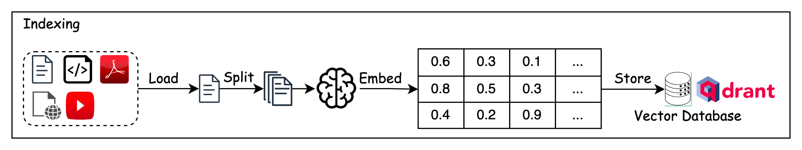
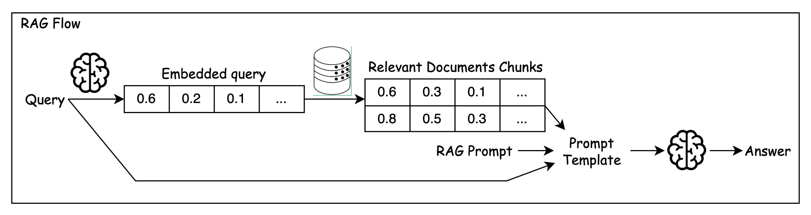
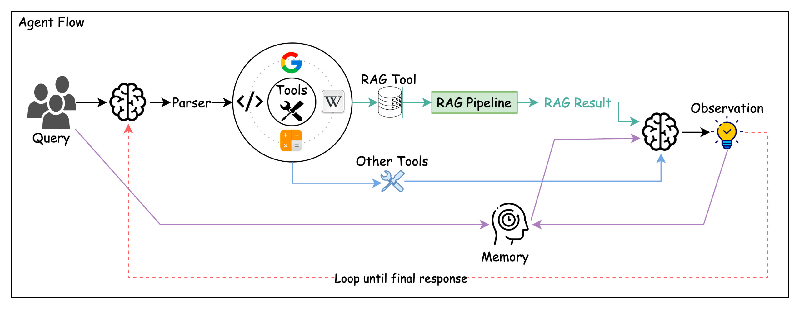
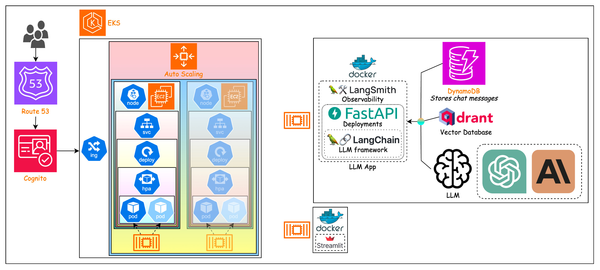

# Large Languge Model-powered applications

## App Logic

### Indexing Flow



### RAG Flow



### Agent Flow



## System Architecture



## AWS

```bash
aws configure
```

```python
# Create DynamoDB table

import boto3

dynamodb = boto3.resource("dynamodb")

table = dynamodb.create_table(
  TableName="LangChainSessionTable",
  KeySchema=[
    { "AttributeName": "SessionId", "KeyType": "HASH" },
    { "AttributeName": "UserId", "KeyType": "RANGE" },
  ],
  AttributeDefinitions=[
    { "AttributeName": "SessionId", "AttributeType": "S" },
    { "AttributeName": "UserId", "AttributeType": "S" },
  ],
  BillingMode="PAY_PER_REQUEST",
)

# Wait until the table exists
table.meta.client.get_waiter("table_exists").wait(TableName="LangChainSessionTable")

```

## Docker

```bash
docker build -t doantronghieu/llm-fastapi:latest -f deploy/docker_k8s/docker-files/Dockerfile.fastapi .
docker build -t doantronghieu/llm-streamlit:latest -f deploy/docker_k8s/docker-files/Dockerfile.streamlit .

docker push doantronghieu/llm-fastapi:latest
docker push doantronghieu/llm-streamlit:latest

---

# Test
docker run -p 8000:8000 doantronghieu/llm-fastapi:latest

docker compose -f docker-compose.yaml up -d
docker compose -f docker-compose.yaml down
---

# For AWS EC2 arm
docker pull doantronghieu/llm-fastapi:latest
docker pull doantronghieu/llm-streamlit:latest

---

eksctl create cluster -f deploy/docker_k8s/eks-cluster.yaml --dry-run

eksctl create cluster -f deploy/docker_k8s/eks-cluster.yaml
kubectl apply -f https://github.com/kubernetes-sigs/metrics-server/releases/latest/download/components.yaml

eksctl upgrade cluster --config-file deploy/docker_k8s/eks-cluster.yaml

eksctl delete cluster --wait --disable-nodegroup-eviction -f deploy/docker_k8s/eks-cluster.yaml 

```

## Environment Variables

```bash
# Models
OPENAI_API_KEY = 
COHERE_API_KEY = 
ANTHROPIC_API_KEY = nz8Uw-FhNdMwAA
GROQ_API_KEY = 

REPLICATE_API_TOKEN = 

LANGCHAIN_TRACING_V2 = 
LANGCHAIN_API_KEY = 

AWS_ACCESS_KEY_ID = 
AWS_SECRET_ACCESS_KEY = 
AWS_DEFAULT_REGION = 

# Tools
TAVILY_API_KEY = 
SERPER_API_KEY = 

# DBs
QDRANT_HOST = 
QDRANT_API_KEY = 
```
