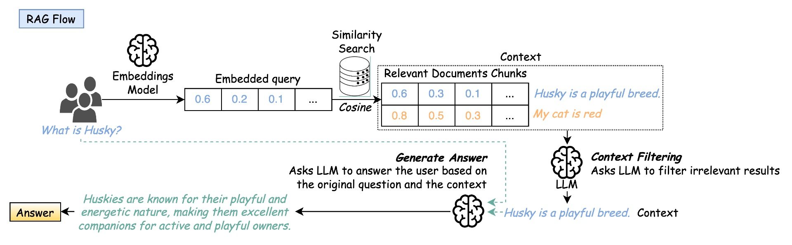
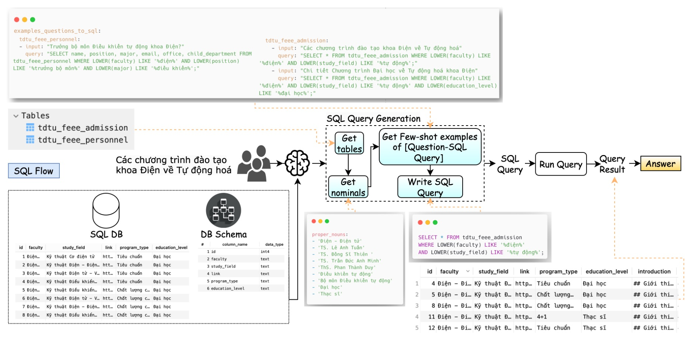
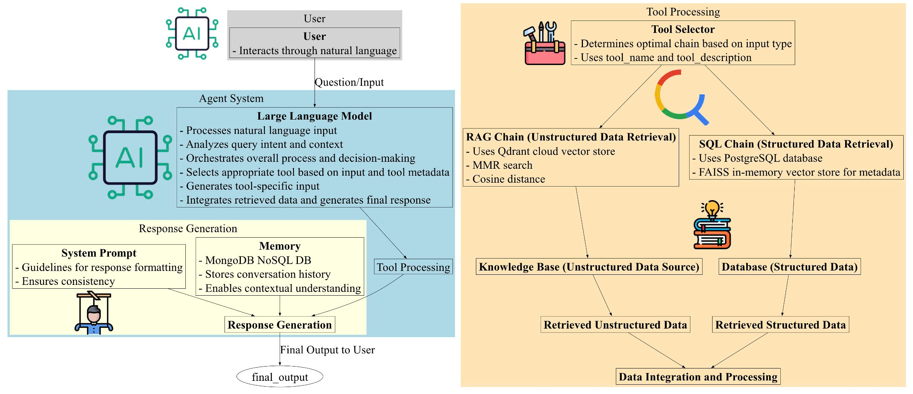
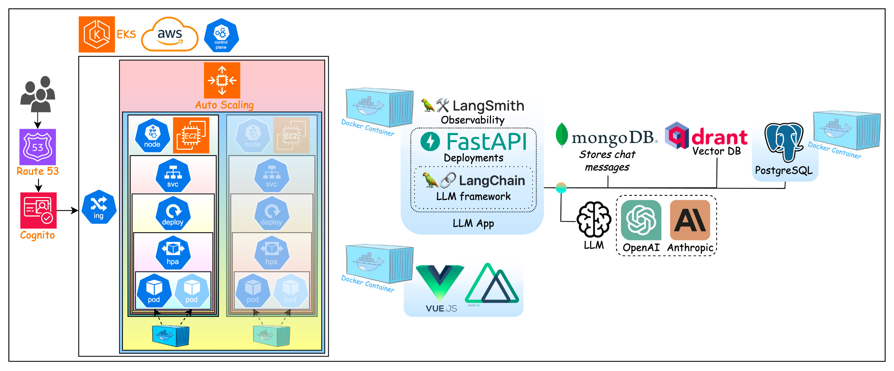

# Large Languge Model-powered applications

[Demo](https://drive.google.com/file/d/1fXI2bWKGI-on2AUz9UEQitSJyxn3WROl/view?usp=sharing)

## App Logic

### Unstructured Data Retrieval Algorithm



### Structured Data Retrieval Algorithm



### Agent System



## System Architecture



## System Setting

### Environment Variables

```bash
# Models
OPENAI_API_KEY = 
COHERE_API_KEY = 
ANTHROPIC_API_KEY = 
GROQ_API_KEY = 

REPLICATE_API_TOKEN = 

LANGCHAIN_TRACING_V2 = 
LANGCHAIN_API_KEY = 
USER_AGENT = MyUserAgent

AWS_ACCESS_KEY_ID = 
AWS_SECRET_ACCESS_KEY = 
AWS_DEFAULT_REGION = 

# Tools
TAVILY_API_KEY = 
SERPER_API_KEY = 

# DBs
MSG_STORAGE_PROVIDER = mongodb # mongodb, dynamodb !!!

QDRANT_HOST = 
QDRANT_API_KEY = 

## Postgres
SQL_DB = mydatabase
SQL_HOST = 127.0.0.1
SQL_PORT = 5432
SQL_USER = myuser
SQL_PASSWORD = mysecretpassword

NEON_URI = 
SQL_DB_NEON = mydatabase
SQL_HOST_NEON = 
SQL_PORT_NEON = 5432
SQL_USER_NEON = my-default-db_owner
SQL_PASSWORD_NEON = 

## MongoDb
MONGODB_ATLAS_CLUSTER_URI = 
MONGODB_DB_NAME = "db_langchain"
MONGODB_COLLECTION_NAME_RAG = "coll_rag_langchain"
MONGODB_COLLECTION_NAME_MSG = "coll_msg_langchain"

```

### AWS

```bash
aws configure
```

```python
# Create DynamoDB table

import boto3

dynamodb = boto3.resource("dynamodb")

table = dynamodb.create_table(
  TableName="LangChainSessionTable",
  KeySchema=[
    { "AttributeName": "SessionId", "KeyType": "HASH" },
    { "AttributeName": "UserId", "KeyType": "RANGE" },
  ],
  AttributeDefinitions=[
    { "AttributeName": "SessionId", "AttributeType": "S" },
    { "AttributeName": "UserId", "AttributeType": "S" },
  ],
  BillingMode="PAY_PER_REQUEST",
)

# Wait until the table exists
table.meta.client.get_waiter("table_exists").wait(TableName="LangChainSessionTable")
```

## Deployment

### Postgres

Put data into container

- Start Postgres container. Do your work ...

```bash
docker compose -f DevOps/Docker/postgres.docker-compose.yaml up -d
docker compose -f DevOps/Docker/postgres.docker-compose.yaml down
```

- Dump data, get data.sql file in local

```bash
docker exec -it postgres  /bin/bash
pg_dump -U myuser -d mydatabase > /var/lib/postgresql/data/data.sql
exit

cp Apps/data/postgres/data.sql Apps/data/data.sql # No need
rm ./data.sql # No need
```

### Build Docker

```bash
docker build -t <DOCKER_USER>/custom-llm-fastapi:latest -f DevOps/Docker/custom/Dockerfile.fastapi.custom .
docker build -t <DOCKER_USER>/custom-llm-nuxtjs:latest -f DevOps/Docker/custom/Dockerfile.nuxtjs.custom .
docker build -t <DOCKER_USER>/custom-llm-postgresql:latest -f DevOps/Docker/custom/Dockerfile.postgresql.custom .

docker push <DOCKER_USER>/custom-llm-fastapi:latest
docker push <DOCKER_USER>/custom-llm-nuxtjs:latest
docker push <DOCKER_USER>/custom-llm-postgresql:latest
```

### Test Docker

#### Separately

```bash
docker run -d -p 8000:8000 --name custom-llm-fastapi <DOCKER_USER>/custom-llm-fastapi:latest
docker run -d -p 3000:3000 --name custom-llm-nuxtjs <DOCKER_USER>/custom-llm-nuxtjs:latest
docker run -d -p 5432:5432 --name custom-llm-postgresql <DOCKER_USER>/custom-llm-postgresql:latest
```

#### All in one

```bash
docker-compose -f DevOps/Docker/custom/custom.docker-compose.yaml up -d
docker-compose -f DevOps/Docker/custom/custom.docker-compose.yaml down
```

#### Cloud Instance

```bash
sudo docker pull <DOCKER_USER>/custom-llm-fastapi:latest
sudo docker pull <DOCKER_USER>/custom-llm-nuxtjs:latest
sudo docker pull <DOCKER_USER>/custom-llm-postgresql:latest

# Remember to change `NUXT_PUBLIC_SERVER_FASTAPI=http://{EC2_IP_ADDR}:8000` in `DevOps/Docker/custom/.env`
docker build -t <DOCKER_USER>/custom-llm-fastapi:latest -f DevOps/Docker/custom/Dockerfile.fastapi.custom .

sudo docker-compose -f DevOps/Docker/custom/custom.docker-compose.yaml up -d
sudo docker-compose -f DevOps/Docker/custom/custom.docker-compose.yaml down
```

### Use Helm to export K8s files

```bash
# Export
helm template DevOps/Helm/ --debug --dry-run > DevOps/Helm/helm-test.yaml 
```

### Create/Update/Delete AWS K8s cluster

```bash
# Test cluster config file
eksctl create cluster -f DevOps/Infra/custom/custom.eks-cluster.yaml --dry-run 
# Create cluster
eksctl create cluster -f DevOps/Infra/custom/custom.eks-cluster.yaml

# Optional
eksctl upgrade cluster --config-file DevOps/Infra/custom/custom.eks-cluster.yaml
eksctl delete cluster --wait --disable-nodegroup-eviction -f DevOps/Infra/custom/custom.eks-cluster.yaml
```

### Apply Config files to K8s cluster

```bash
kubectl apply -f https://github.com/kubernetes-sigs/metrics-server/releases/latest/download/components.yaml
kubectl apply -f https://github.com/cert-manager/cert-manager/releases/download/v1.15.1/cert-manager.yaml

kubectl apply -f DevOps/K8s/config-map.yaml
kubectl apply -f DevOps/K8s/volume.yaml
kubectl apply -f DevOps/K8s/deployment.yaml
kubectl apply -f DevOps/K8s/hpa.yaml
kubectl apply -f DevOps/K8s/service.yaml

#*** Check ***#
# Check if the TLS certificate has been generated 
kubectl get secret my-domain-tls
kubectl get ingress my-ingress
# Check if the Ingress resource is using the TLS certificate
kubectl describe ingress my-ingress 
# Check if the Ingress controller is using the TLS certificate (Volumes -> Secret -> tls.crt, tls.key)
kubectl describe pod <ingress-controller-pod-name>

```

### Apply Logging to K8s cluster

Remember to replace your-storage-class with your actual storage class name, and kibana.yourdomain.com with your actual domain.

```bash
# temp
helm repo add elastic https://helm.elastic.co
helm repo add fluent https://fluent.github.io/helm-charts
helm repo update
kubectl create namespace logging
helm install elasticsearch elastic/elasticsearch -n logging
helm install fluentd fluent/fluentd -n logging
helm install kibana elastic/kibana -n logging
# temp

kubectl create namespace logging

helm repo add elastic https://helm.elastic.co
helm repo add fluent https://fluent.github.io/helm-charts
helm repo update

helm install elasticsearch elastic/elasticsearch \
  --namespace logging \
  --set clusterName=elasticsearch \
  --set nodeGroup=master \
  --set minimumMasterNodes=2 \
  --set replicas=3 \
  --set volumeClaimTemplate.storageClassName=your-storage-class \
  --set volumeClaimTemplate.resources.requests.storage=100Gi \
  --set resources.requests.cpu=1 \
  --set resources.limits.cpu=2 \
  --set resources.requests.memory=2Gi \
  --set resources.limits.memory=4Gi \
  --set xpack.security.enabled=true \
  --set xpack.security.transport.ssl.enabled=true

helm install fluentd fluent/fluentd \
  --namespace logging \
  --set persistence.enabled=true \
  --set persistence.storageClass=your-storage-class \
  --set persistence.size=10Gi \
  --set resources.requests.cpu=100m \
  --set resources.limits.cpu=500m \
  --set resources.requests.memory=200Mi \
  --set resources.limits.memory=500Mi

helm install kibana elastic/kibana \
  --namespace logging \
  --set elasticsearchHosts=http://elasticsearch-master:9200 \
  --set replicas=2 \
  --set resources.requests.cpu=500m \
  --set resources.limits.cpu=1 \
  --set resources.requests.memory=1Gi \
  --set resources.limits.memory=2Gi

kubectl apply -f kibana-ingress.yaml
kubectl apply -f fluentd-config.yaml

helm upgrade fluentd fluent/fluentd \
  --namespace logging \
  --reuse-values \
  --set configMap=fluentd-config

kubectl get pods -n logging
kubectl get services -n logging
kubectl get ingress -n logging

```

## Debug

```bash
# [Nuxt.js] Call FastAPI server
wget --header='accept: application/json' 'http://fastapi:8000/stream-agent?query=Ch%C3%A0o&history_type=mongodb&session_id=default' -O -


```
